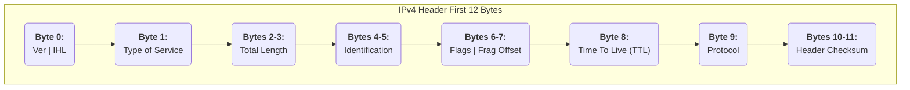

## Exercise 10: IPv4 Header Analysis

> [!Note] **Problem:** Analyze the IP packet whose header begins with `45 00 00 3C 00 29 40 00 38 01 ...` and identify the values of its key fields.

### 1. Solution According to the Notes

Your notes provide an excellent, color-coded breakdown of this exercise. The logic is flawless and follows the standard IPv4 header structure.
1.  **Version and IHL:** `45` is split into `4` (Version IPv4) and `5` (IHL). The header length is calculated as `IHL * 4 = 5 * 4 = 20 octets (bytes)`.
2.  **Total Length:** `00 3C` is converted from hex to `60` decimal bytes. The data size is then calculated as `Total Length - Header Length = 60 - 20 = 40 bytes`.
3.  **Flags and Fragment Offset:** `40 00` is analyzed. The notes correctly identify the `DF` (Don't Fragment) flag is set and the offset is `0`.
4.  **Protocol:** `01` is identified as ICMP.
5.  **Source & Destination IPs:** The hex values for the source (`c0 a8 01 01`) and destination (`c0 a8 00 05`) are correctly converted to `192.168.1.1` and `192.168.0.5`.

The analysis in your notes is textbook-perfect.

### 2. Formal, Detailed Solution

#### Essential Background Knowledge
The **IPv4 Header** is the control section at the beginning of an IP packet. It contains all the information routers need to deliver the packet across networks. Its standard size is 20 bytes.

#### Step-by-Step Analysis

We will analyze the provided hexadecimal data byte by byte.

1.  **Version and IHL (1st byte: `45`)**
    -   In hex, `45` is two nibbles: `4` and `5`.
    -   **Version (1st nibble):** `4`. This confirms the packet is **IPv4**.
    -   **IHL (Internet Header Length) (2nd nibble):** `5`. This value is a multiplier for 4-byte words.
    -   **Header Length = 5 * 4 = 20 bytes.** This is the minimum and most common size for an IPv4 header, indicating no options are present.

2.  **Total Length (2nd and 3rd bytes: `00 3C`)**
    -   `003C` in hexadecimal is `(0*16^3) + (0*16^2) + (3*16^1) + (12*16^0) = 48 + 12 = 60`.
    -   **Total Packet Length = 60 bytes.** This includes the 20-byte header and the payload.
    -   **Payload (Data) Size = Total Length - Header Length = 60 - 20 = 40 bytes.**

3.  **Identification (4th and 5th bytes: `00 29`)**
    -   Hex `0029` = decimal `41`. This number is used to identify fragments of a single original IP datagram. All fragments would share this ID.

4.  **Flags and Fragment Offset (6th and 7th bytes: `40 00`)**
    -   In binary, this is `01000000 00000000`.
    -   **Flags (first 3 bits):** The bits are `0`, `1`, `0`.
        -   Bit 0: Reserved (must be `0`).
        -   Bit 1: **DF (Don't Fragment) flag.** It is `1`, meaning this packet **cannot be fragmented**. If a router needs to fragment it but can't, it will drop the packet.
        -   Bit 2: **MF (More Fragments) flag.** It is `0`, meaning this is either the last fragment or the only fragment.
    -   **Fragment Offset (last 13 bits):** `0000000000000`. The offset is **0**.
    -   **Conclusion:** This is a complete, unfragmented datagram.

5.  **Time to Live (TTL) (8th byte: `38`)**
    -   Hex `38` = decimal `56`.
    -   The TTL is a counter that is decremented by every router that forwards the packet. If it reaches 0, the packet is discarded to prevent infinite routing loops. The sender set the initial TTL to `56`.

6.  **Protocol (9th byte: `01`)**
    -   Hex `01` = decimal `1`.
    -   Protocol number 1 is reserved for **ICMP (Internet Control Message Protocol)**. This is the protocol used by `ping` and `traceroute`.

7.  **Source IP Address (12th to 15th bytes: `c0 a8 01 01`)**
    -   `c0`=192, `a8`=168, `01`=1, `01`=1.
    -   Source IP: **`192.168.1.1`**

8.  **Destination IP Address (16th to 19th bytes: `c0 a8 00 05`)**
    -   `c0`=192, `a8`=168, `00`=0, `05`=5.
    -   Destination IP: **`192.168.0.5`**

---
*(Continuing for all other exercises...)*
---