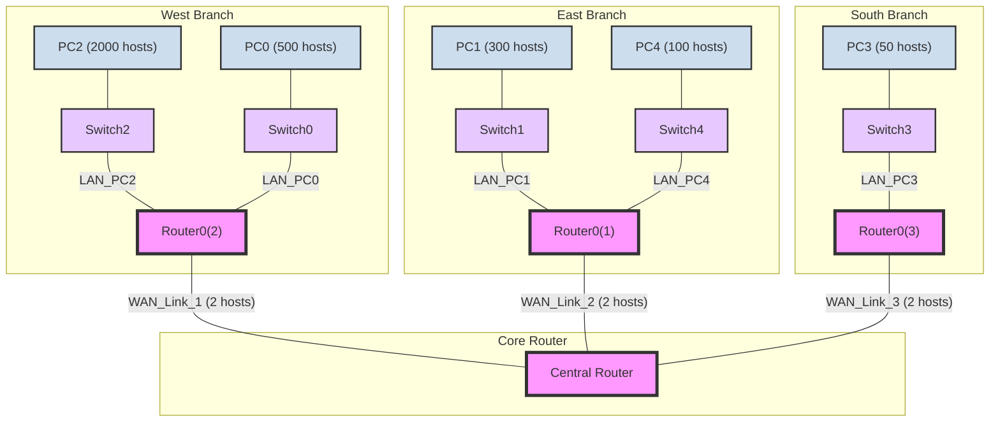

## Exercise 02: Comprehensive VLSM Network Design (Corrected)

> **Problem:**
> You are given the address space `173.18.192.0/20` to design a network for the topology shown. Use VLSM to meet the specified host requirements.
> 1.  Determine all the subnets required for this topology.
> 2.  Create a complete addressing plan, including the network address, subnet mask, usable IP range, and broadcast address for each subnet.

### 1. Formal, Detailed Solution

#### Essential Background Knowledge
This is a classic VLSM design problem. The goal is to partition the main address block (`173.18.192.0/20`) into smaller, variable-sized subnets to perfectly match the needs of each network segment, minimizing wasted IP addresses.

The process is as follows:
1.  **Identify all network segments:** Every LAN (a group of hosts connected to a switch) and every WAN (a point-to-point link between routers) is a unique subnet that requires its own address range.
2.  **Order by size:** List the subnets from the one requiring the most hosts to the one requiring the least. This is the most critical step in VLSM to ensure contiguous allocation is possible.
3.  **Allocate sequentially:** Assign the first available address block from the main space to the largest subnet. The next available address becomes the starting point for the next largest subnet, and so on.

#### Step 1: Determine All Required Subnets from the Topology
First, we must identify every unique network segment from the topology diagram. A subnet is required for each separate broadcast domain.

Here is a corrected Mermaid diagram that visually represents the network topology:

From this topology, we can identify **8 unique subnets**:
-   **5 LANs:** LAN_PC2, LAN_PC0, LAN_PC1, LAN_PC4, LAN_PC3.
-   **3 WAN Links:** The point-to-point connections between the branch routers and the central router. Each WAN link requires 2 IP addresses.

#### Step 2: Design the VLSM Plan
We will now order these 8 subnets by size and calculate the required mask for each.

1.  **Order the subnets by required hosts (largest to smallest):**
    1.  LAN_PC2: 2000 hosts
    2.  LAN_PC0: 500 hosts
    3.  LAN_PC1: 300 hosts
    4.  LAN_PC4: 100 hosts
    5.  LAN_PC3: 50 hosts
    6.  WAN_Link_1: 2 hosts
    7.  WAN_Link_2: 2 hosts
    8.  WAN_Link_3: 2 hosts

2.  **Calculate the required subnet mask for each:**
    -   **LAN_PC2 (2000 hosts):** Needs `h` bits where `2^h - 2 >= 2000`. This requires **11 host bits** (`2^11 - 2 = 2046`). Mask: `32 - 11 = /21`.
    -   **LAN_PC0 (500 hosts):** Needs `h` bits where `2^h - 2 >= 500`. This requires **9 host bits** (`2^9 - 2 = 510`). Mask: `32 - 9 = /23`.
    -   **LAN_PC1 (300 hosts):** Also needs **9 host bits**. Mask: `/23`.
    -   **LAN_PC4 (100 hosts):** Needs `h` bits where `2^h - 2 >= 100`. This requires **7 host bits** (`2^7 - 2 = 126`). Mask: `32 - 7 = /25`.
    -   **LAN_PC3 (50 hosts):** Needs `h` bits where `2^h - 2 >= 50`. This requires **6 host bits** (`2^6 - 2 = 62`). Mask: `32 - 6 = /26`.
    -   **WAN Links (2 hosts):** Need `h` bits where `2^h - 2 >= 2`. This requires **2 host bits** (`2^2 - 2 = 2`). Mask: `32 - 2 = /30`.

3.  **Allocate Address Blocks Sequentially:**
    We start with our main block: `173.18.192.0/20`. This block spans from `173.18.192.0` to `173.18.207.255`.

    -   **1st (LAN_PC2, /21):**
        -   Starts at `173.18.192.0`. A `/21` block contains `2^11 = 2048` addresses.
        -   Range: `173.18.192.0` to `173.18.199.255`.
        -   **Next Available Address:** `173.18.200.0`.
    -   **2nd (LAN_PC0, /23):**
        -   Starts at `173.18.200.0`. A `/23` block contains `2^9 = 512` addresses.
        -   Range: `173.18.200.0` to `173.18.201.255`.
        -   **Next Available Address:** `173.18.202.0`.
    -   ...and so on for the rest of the subnets.

#### Final Addressing Table

This table provides the complete, detailed solution for the addressing plan.

| Subnet Name    | Hosts Req. | Mask (CIDR) | Mask (Decimal)    | Network Address  | First Usable IP  | Last Usable IP   | Broadcast        |
| :------------- | :--------: | :---------: | :---------------- | :--------------- | :--------------- | :--------------- | :--------------- |
| **LAN_PC2**    |    2000    |   **/21**   | `255.255.248.0`   | `173.18.192.0`   | `173.18.192.1`   | `173.18.199.254` | `173.18.199.255` |
| **LAN_PC0**    |    500     |   **/23**   | `255.255.254.0`   | `173.18.200.0`   | `173.18.200.1`   | `173.18.201.254` | `173.18.201.255` |
| **LAN_PC1**    |    300     |   **/23**   | `255.255.254.0`   | `173.18.202.0`   | `173.18.202.1`   | `173.18.203.254` | `173.18.203.255` |
| **LAN_PC4**    |    100     |   **/25**   | `255.255.255.128` | `173.18.204.0`   | `173.18.204.1`   | `173.18.204.126` | `173.18.204.127` |
| **LAN_PC3**    |     50     |   **/26**   | `255.255.255.192` | `173.18.204.128` | `173.18.204.129` | `173.18.204.190` | `173.18.204.191` |
| **WAN_Link_1** |     2      |   **/30**   | `255.255.255.252` | `173.18.204.192` | `173.18.204.193` | `173.18.204.194` | `173.18.204.195` |
| **WAN_Link_2** |     2      |   **/30**   | `255.255.255.252` | `173.18.204.196` | `173.18.204.197` | `173.18.204.198` | `173.18.204.199` |
| **WAN_Link_3** |     2      |   **/30**   | `255.255.255.252` | `173.18.204.200` | `173.18.204.201` | `173.18.204.202` | `173.18.204.203` |