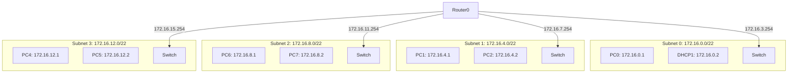

### Exercise 01: MAC Addresses
Given the following MAC addresses:
a) `01-00-5E-AB-CD-EF`
b) `00-00-25-47-EF-CD`
c) `11-52-AB-9B-DC-12`
d) `00-01-4B-B4-A2-EF`

1. Give the type of each of the MAC addresses above.
2. Can these addresses belong to the "source address" field of an Ethernet frame? Justify.

### Exercise 02: Ethernet Frame Analysis
1. Analyze the Ethernet frame given below (the 'Preamble' and 'FCS' fields are removed) by specifying the MAC addresses, the 'Type' field, and the 'Data' field (what do you notice regarding this field?).
   
   ```text
   ffff ffff ffff 09ab 14d8 0548 0806 0001
   0800 0604 0001 09ab 14d8 0548 7d05 300a
   0000 0000 0000 7d12 6e03
   ```
2. Indicate the type of the destination MAC address.

### Exercise 03: IP Address Validation
For each of the following IP addresses, determine if it is a valid and usable address or not.
If yes, indicate: the class, the network part, the host part, the network address, and the broadcast address.

*   131.107.256.80
*   127.1.1.1
*   255.255.255.255
*   214.0.0.4
*   222.222.255.222
*   198.121.254.255
*   132.4.0.5
*   126.1.0.0
*   231.200.1.1
*   10.4.200.200
*   248.5.10.156
*   191.48.54.100

### Exercise 04: Local Communication
You are given the machine addresses below. Machine 1 wants to send a global message on its network. Give the destination IP address it will use and give the numbers of the machines that will be able to answer its request.

*   @IP machine 1 : 192.175.60.3
*   @IP machine 2 : 192.175.60.4
*   @IP machine 3 : 192.176.60.3
*   @IP machine 4 : 192.175.60.5
*   @IP machine 5 : 192.175.60.38
*   @IP machine 6 : 172.175.60.38
*   @IP machine 7 : 92.175.60.38

### Exercise 05: Subnetting Basics
Let M be a machine whose IP address is M: `184.65.94.20`.
1. What is the class and the address of the network hosting M?

Suppose we equip this network with the subnet mask `255.255.240.0`.
2. How many subnets are then possible and how many machines can be hosted in each?
3. What is the number of the subnet hosting M?
4. Among the machines M1, M2…, M6, indicate those that belong to the same subnet as M:
    *   M1 : 184.65.75.1
    *   M2 : 184.65.100.1
    *   M3 : 184.65.90.1
    *   M4 : 184.65.78.1
    *   M5 : 184.65.87.1
    *   M6 : 184.65.94.1

### Exercise 06: Reverse Subnet Calculation
Calculate the subnet mask and the number of machines per subnet.

| NetID | Number of SR | Masque | Nbr machines / SR |
| :--- | :--- | :--- | :--- |
| 148.25.0.0 | 37 | | |
| 198.63.24.0 | 2 | | |
| 110.0.0.0 | 1000 | | |
| 175.23.0.0 | 550 | | |
| 209.206.202.0 | 60 | | |

### Exercise 07: Subnetting a /20
We want to split the network `172.16.0.0/20` (meaning the network mask is: `255.255.240.0`) into 4 subnets.
1. How many bits are necessary to define 4 subnets?
2. Give the corresponding subnet mask.
3. How many machines can be hosted in each subnet?
4. Complete the table below (SR0 to SR3).
5. Complete the provided schema (Router with interfaces) indicating the first two machine addresses for each subnet and the router interface addresses.

### Exercise 08: Configuration Analysis
A and B are two users of the same company. User A has address `143.27.102.101` and reads in their configuration file: subnet mask `255.255.192.0` and default gateway `143.27.105.1`.
1. What is the address of the subnet to which A belongs? What is the broadcast address on this subnet?
2. User B has address `143.27.172.101` and reads the same: subnet mask `255.255.192.0`.
    a. Is B on the same subnet as A?
    b. Can they use the same default gateway address as A?

### Exercise 09: IP Planning
In an Ethernet local network, we have 50 user machines, distributed into 5 groups of 10 machines and 7 servers (1 specific server in each group and 2 servers common to all users). In each of the 5 groups, user machines are connected to a 12-port hub.
1. The company owns the IP address `193.22.172.0`. Can we distribute the addresses by making all groups appear? If yes, how? Propose an addressing plan.

Let an enterprise router connect 4 subnets RL1, RL2, RL3, and RL4 and offer access to the Internet. The company has a Class C IP address with Network ID `195.52.100.0`. In subnet RL1, there are 15 workstations, in RL2 20 workstations, RL3 25 workstations, RL4 30 workstations.
a. Can we imagine an addressing plan with 4 distinct subnets?
b. What will be the subnet mask then?

### Exercise 10: Packet Analysis (Wireshark)
We have represented below the result of a capture by Wireshark software of an Ethernet frame (neither the preamble nor the FCS are represented).

*Hex Dump:*
```text
00 1a 73 24 44 89 00 12 17 41 c2 c7 08 00 45 00
00 3c 00 29 00 00 96 01 a0 dd c0 a8 01 01 c0 a8
01 69 00 00 55 56 00 01 00 05 61 62 63 64 65 66
67 68 69 6a 6b 6c 6d 6e 6f 70 71 72 73 74 75 76
77 61 62 63 64 65 66 67 68 69
```

1. Extract the fields composing the Ethernet frame:
    * Source MAC Address
    * Destination MAC Address
    * The content of the protocol type field. Deduce the encapsulated protocol in the frame.
2. Extract the fields composing the IP packet contained in the Ethernet frame:
    * The protocol version
    * The header length
    * The total length of the IP datagram. Deduce the data size.
    * The identifier assigned to the datagram
    * The value of fields DF, MF, and fragment offset. Deduce if the datagram is fragmented.
    * The TTL field value
    * The protocol field content. Deduce the encapsulated protocol in the IP packet.
    * The source and destination IP addresses.

### Exercise 11: Fragmentation Calculation 1
Let an IP datagram of 3820 bytes without options be encapsulated in a frame with MTU 1500 bytes.
How many fragments will be generated? What is the offset value of each fragment?

### Exercise 12: Fragmentation Calculation 2
A datagram of 2000 bytes (having identifier 10) must be transmitted on a network supporting an MTU of 512 bytes. If the IP header used is at its minimum, find the value of the following fields for each transmitted datagram (fragment):
*   Identification
*   Total packet length
*   Fragment offset
*   More fragment flag

---

## Part 2: Detailed Solutions & Explanations

### 1. Solution - Exercise 01: MAC Addresses

**1. Determine the type of each MAC Address**

> [!INFO] Concept: MAC Address Types
> To determine the type of a MAC address (Unicast vs. Multicast), we look at the **Least Significant Bit (LSB)** of the **first byte** (the first 2 hex digits).
> *   If the LSB is `0` $\rightarrow$ **Unicast** (One-to-One).
> *   If the LSB is `1` $\rightarrow$ **Multicast** or Broadcast (One-to-Many).
>
> **Visualizing the First Byte:**
> Example: `01` (Hex) = `0000 0001` (Binary). The last bit is `1`.

**Analysis of the given addresses:**

| Address | First Byte (Hex) | Binary | LSB (Bit 0) | Type |
| :--- | :--- | :--- | :--- | :--- |
| a) 01-00-5E-AB-CD-EF | `01` | `0000 0001` | **1** | **Multicast** |
| b) 00-00-25-47-EF-CD | `00` | `0000 0000` | **0** | **Unicast** |
| c) 11-52-AB-9B-DC-12 | `11` | `0001 0001` | **1** | **Multicast** |
| d) 00-01-4B-B4-A2-EF | `00` | `0000 0000` | **0** | **Unicast** |

**2. Can these addresses be a "Source Address"?**

*   **Rule:** A source address must *always* identify a specific sender. Therefore, it must be **Unicast**. A machine cannot "send" as a group (multicast).
*   **Result:**
    *   **Valid Source Addresses:** (b) and (d) (Because they are Unicast).
    *   **Invalid Source Addresses:** (a) and (c) (Because they are Multicast).

---

### 2. Solution - Exercise 02: Frame Analysis

**1. Analyze the Frame Fields**

The raw data is provided in hexadecimal. We analyze the standard Ethernet II frame structure.

**Frame Structure:**
`[Dest MAC (6 bytes)] [Source MAC (6 bytes)] [Type (2 bytes)] [Data (46-1500 bytes)] [FCS (4 bytes - removed)]`

**Extraction:**
*   **Destination MAC:** The first 6 bytes.
    *   Value: `ffff ffff ffff`
*   **Source MAC:** The next 6 bytes.
    *   Value: `09ab 14d8 0548`
*   **Type:** The next 2 bytes.
    *   Value: `0806`
    *   **Meaning:** This hex code corresponds to the **ARP Protocol** (Address Resolution Protocol).
*   **Data:** Everything following the type.
    *   Start: `0001 0800 ...`
    *   End: `... 6e03`
    *   *Observation:* Since the type is ARP, this data constitutes the ARP packet structure (Hardware type, Protocol type, etc.).

**2. Destination MAC Type**

*   Address: `FF-FF-FF-FF-FF-FF`
*   **Type:** **Broadcast**.
*   **Reasoning:** All bits are set to 1. This frame is sent to everyone on the LAN.

---

### 3. Solution - Exercise 03: IP Validation

> [!TIP] Reminder: IP Classes & Special Ranges
> *   **Class A:** 1 - 126 (0 and 127 are reserved)
> *   **Class B:** 128 - 191
> *   **Class C:** 192 - 223
> *   **Class D (Multicast):** 224 - 239
> *   **Class E (Reserved):** 240 - 255
> *   **127.x.x.x:** Loopback (Localhost).
> *   **Host part = all 0s:** Network Address (Not usable for host).
> *   **Host part = all 1s:** Broadcast Address (Not usable for host).

| IP Address | Valid? | Reason / Class Details |
| :--- | :--- | :--- |
| **131.107.256.80** | **NO** | Invalid Octet (256 > 255). |
| **127.1.1.1** | **NO** | Reserved for Loopback (localhost). |
| **255.255.255.255** | **NO** | Limited Broadcast Address (Class E/Reserved range context). |
| **214.0.0.4** | **YES** | **Class C**. Net: `214.0.0.0`. Host: `4`. Broadcast: `214.0.0.255`. |
| **222.222.255.222** | **YES** | **Class C**. Net: `222.222.255.0`. Host: `222`. Broadcast: `222.222.255.255`. |
| **198.121.254.255** | **NO** | **Class C**. Invalid because Host part is `.255` (Broadcast address). |
| **132.4.0.5** | **YES** | **Class B**. Net: `132.4.0.0`. Host: `0.5`. Broadcast: `132.4.255.255`. |
| **248.5.10.156** | **NO** | **Class E** (Reserved/Experimental). |
| **231.200.1.1** | **NO** | **Class D** (Multicast). Cannot be assigned to a single host interface. |
| **10.4.200.200** | **YES** | **Class A**. Net: `10.0.0.0`. Host: `4.200.200`. Broadcast: `10.255.255.255`. |
| **126.1.0.0** | **YES** | **Class A**. Net: `126.0.0.0`. Host: `1.0.0`. Broadcast: `126.255.255.255`. |
| **191.48.54.100** | **YES** | **Class B**. Net: `191.48.0.0`. Host: `54.100`. Broadcast: `191.48.255.255`. |

---

### 4. Solution - Exercise 04: Local Communication

**Context:** Machine 1 (`192.175.60.3`) wants to send a **global message** (Broadcast).

1.  **Analyze Machine 1:**
    *   IP: `192.175.60.3`
    *   Class: **C** (Range 192-223).
    *   Default Mask: `255.255.255.0` (/24).
    *   Network ID: `192.175.60.0`
    *   **Broadcast Address:** `192.175.60.255`

2.  **Destination Address used:**
    *   Machine 1 sends to `192.175.60.255`.

3.  **Who receives/replies?**
    *   Only machines on the **same network** (`192.175.60.x`) will receive the Layer 3 broadcast.
    *   **Machine 2:** `192.175.60.4` $\rightarrow$ **YES** (Same NetID).
    *   **Machine 3:** `192.176.60.3` $\rightarrow$ **NO** (Different NetID `192.176.60.0`).
    *   **Machine 4:** `192.175.60.5` $\rightarrow$ **YES** (Same NetID).
    *   **Machine 5:** `192.175.60.38` $\rightarrow$ **YES** (Same NetID).
    *   **Machine 6:** `172.175.60.38` $\rightarrow$ **NO** (Class B, totally different network).
    *   **Machine 7:** `92.175.60.38` $\rightarrow$ **NO** (Class A, totally different network).

**Responders:** Machines **2, 4, and 5**.

---

### 5. Solution - Exercise 05: Subnetting Logic

**1. Class and Network of M (184.65.94.20)**
*   First octet `184` falls in range 128-191.
*   **Class:** **B**.
*   **Default Network:** `184.65.0.0` (Mask 255.255.0.0).

**2. New Mask Analysis: 255.255.240.0**
*   Binary Mask: `11111111.11111111.11110000.00000000` (/20).
*   Default Class B Mask: `11111111.11111111.00000000.00000000` (/16).
*   **Borrowed Bits (Subnet Bits):** $20 - 16 = 4$ bits.
*   **Host Bits Remaining:** $32 - 20 = 12$ bits.

*   **Number of Subnets:** $2^{\text{borrowed}} = 2^4 = 16$.
*   **Hosts per Subnet:** $2^{\text{host\_bits}} - 2 = 2^{12} - 2 = 4096 - 2 = 4094$.

**3. Find Subnet for M (184.65.94.20)**
We look at the interesting octet (the 3rd one, where the mask changes).
*   IP (3rd octet): `94` = `0101 1110`
*   Mask (3rd octet): `240` = `1111 0000`
*   **AND Operation:** `0101 0000` = **80** (Decimal).
*   **Subnet Address:** `184.65.80.0`.

**4. Check Machines M1...M6**
We must check if they fall in the range `184.65.80.0` to `184.65.95.255` (Block size is $256 - 240 = 16$).
*Range:* `80` to `80+16-1 = 95` in the third octet.

*   M1 (`...75.1`): $75 < 80$ $\rightarrow$ **NO**.
*   M2 (`...100.1`): $100 > 95$ $\rightarrow$ **NO**.
*   M3 (`...90.1`): $80 \le 90 \le 95$ $\rightarrow$ **YES**.
*   M4 (`...78.1`): $78 < 80$ $\rightarrow$ **NO**.
*   M5 (`...87.1`): $80 \le 87 \le 95$ $\rightarrow$ **YES**.
*   M6 (`...94.1`): $80 \le 94 \le 95$ $\rightarrow$ **YES**.

**Answer:** M3, M5, and M6.

---

### 6. Solution - Exercise 06: Calculating Masks

> [!INFO] Formula
> 1.  Find required bits for subnets ($n$): $2^n \ge \text{Number of SR}$.
> 2.  New CIDR = Default CIDR + $n$.
> 3.  Convert CIDR to Decimal Mask.
> 4.  Host bits ($h$) = $32 - \text{New CIDR}$.
> 5.  Hosts/SR = $2^h - 2$.

| NetID (Class) | Needed SR | Calc $n$ ($2^n \ge SR$) | New CIDR | Mask | Hosts ($2^h-2$) |
| :--- | :--- | :--- | :--- | :--- | :--- |
| **148.25.0.0 (B)** | 37 | $2^6 = 64$ ($n=6$) | $/16+6 = /22$ | **255.255.252.0** | $2^{10}-2 = 1022$ |
| **198.63.24.0 (C)** | 2 | $2^1 = 2$ ($n=1$) | $/24+1 = /25$ | **255.255.255.128** | $2^7-2 = 126$ |
| **110.0.0.0 (A)** | 1000 | $2^{10}=1024$ ($n=10$) | $/8+10 = /18$ | **255.255.192.0** | $2^{14}-2 = 16382$ |
| **175.23.0.0 (B)** | 550 | $2^{10}=1024$ ($n=10$) | $/16+10 = /26$ | **255.255.255.192** | $2^6-2 = 62$ |
| **209.206.202.0 (C)** | 60 | $2^6=64$ ($n=6$) | $/24+6 = /30$ | **255.255.255.252** | $2^2-2 = 2$ |

---

### 7. Solution - Exercise 07: Subnetting 172.16.0.0/20

**Initial State:** `172.16.0.0/20`.
**Goal:** Create 4 subnets.

1.  **Bits Necessary:**
    $2^n = 4 \rightarrow n = 2$ bits.

2.  **New Mask:**
    Initial: /20.
    New: $/20 + 2 = /22$.
    Decimal: **255.255.252.0**.

3.  **Machines per Subnet:**
    Host bits: $32 - 22 = 10$ bits.
    Calculation: $2^{10} - 2 = 1024 - 2 = \mathbf{1022}$.

4.  **Subnet Table (Block size = $2^{24-22} = 2^2 = 4$ in 3rd octet):**

| N° | Address SR | First Address | Last Address | Broadcast |
| :--- | :--- | :--- | :--- | :--- |
| **SR0** | 172.16.0.0 | 172.16.0.1 | 172.16.3.254 | 172.16.3.255 |
| **SR1** | 172.16.4.0 | 172.16.4.1 | 172.16.7.254 | 172.16.7.255 |
| **SR2** | 172.16.8.0 | 172.16.8.1 | 172.16.11.254 | 172.16.11.255 |
| **SR3** | 172.16.12.0 | 172.16.12.1 | 172.16.15.254 | 172.16.15.255 |

5.  **Schema Completion:**
    *   **Router Interfaces:** Usually the *last* usable IP (based on instruction: "last usable address in each range").
    *   **Hosts:** First two addresses.



---

### 8. Solution - Exercise 08: User A vs User B

**1. Analyze User A**
*   IP: `143.27.102.101`
*   Mask: `255.255.192.0` (/18)
*   **Subnet Calculation (ANDing 3rd octet):**
    *   IP: `102` = `0110 0110`
    *   Mask: `192` = `1100 0000`
    *   Result: `0100 0000` = `64`
*   **Subnet ID:** `143.27.64.0`
*   **Block Size:** $256 - 192 = 64$.
*   Range: `64.0` to `127.255`.
*   **Broadcast:** `143.27.127.255`.

**2. Analyze User B**
*   IP: `143.27.172.101`
*   Mask: `255.255.192.0`
*   **Subnet Calculation:**
    *   IP: `172` = `1010 1100`
    *   Mask: `192` = `1100 0000`
    *   Result: `1000 0000` = `128`
*   **Subnet ID:** `143.27.128.0`.

**Answers:**
*   **a. Are they on the same subnet?**
    **NO**. A is on `64.0` network, B is on `128.0` network.
*   **b. Can B use A's router (143.27.105.1)?**
    Let's check the router IP: `143.27.105.1`.
    $105$ AND $192 = 64$.
    The router is on the `64.0` subnet (Same as A).
    **NO**, B cannot use this router because a Default Gateway must act as a bridge on the *same* local subnet as the host. B needs a gateway in the `143.27.128.x` range.

---

### 9. Solution - Exercise 09: Planning

**Part 1: 50 machines**
*   Needs: 5 groups. Each group has 10 users + 1 local server = 11 hosts.
*   Also 2 common servers.
*   Total hosts: 50 users + 7 servers = 57.
*   Address: `193.22.172.0` (Class C).
*   **Addressing:**
    *   Can we split into 5 subnets? $2^3 = 8$ subnets (borrowing 3 bits).
    *   Hosts per subnet: $2^5 - 2 = 30$ hosts.
    *   Requirement: 11 hosts per group. 30 > 11. **YES**, it fits.

**Part 2: Router with RL1, RL2, RL3, RL4**
*   Network: `195.52.100.0` (Class C).
*   Needs: RL1 (15), RL2 (20), RL3 (25), RL4 (30).
*   **a. Distinct subnets?**
    *   Max need is 30 hosts.
    *   To fit 30 hosts, we need 5 host bits ($2^5-2 = 30$).
    *   Remaining bits for subnet: $8 - 5 = 3$ bits.
    *   $2^3 = 8$ subnets possible. We need 4.
    *   **YES**, we can make 4 subnets.
*   **b. Subnet Mask?**
    *   We preserve 5 bits for hosts. Mask is /27.
    *   Decimal: `255.255.255.224`.

---

### 10. Solution - Exercise 10: Packet Dissection

**1. Ethernet Frame Fields**
Referencing the Hex dump: `00 1a 73...`

*   **Dest MAC:** First 6 bytes $\rightarrow$ `00:1a:73:24:44:89`
*   **Source MAC:** Next 6 bytes $\rightarrow$ `00:12:17:41:c2:c7`
*   **Type:** Next 2 bytes $\rightarrow$ `08 00` (Hex).
    *   **Protocol:** **IPv4**.

**2. IP Packet Fields**
Starts at the byte following `08 00`, which is `45`.

*   **Version:** First digit of `45` $\rightarrow$ **4** (IPv4).
*   **IHL (Header Length):** Second digit of `45` $\rightarrow$ **5**.
    *   Length in bytes = $5 \times 4$ bytes = **20 bytes**.
*   **Total Length:** Next 2 bytes `00 3c`.
    *   Hex `3C` = $3 \times 16 + 12$ = **60 bytes**.
    *   **Data Size:** Total - Header = $60 - 20$ = **40 bytes**.
*   **Identification:** Next 2 bytes `00 29`.
    *   Decimal: $2 \times 16 + 9$ = **41**.
*   **Flags & Offset:** Next 2 bytes `00 00`.
    *   Binary: `0000 0000 ...`
    *   Bit 0: Reserved.
    *   Bit 1 (DF): 0 (May Fragment).
    *   Bit 2 (MF): 0 (Last Fragment).
    *   Offset: 0.
    *   **Fragmented?** No (Offset 0, MF 0).
*   **TTL:** Next byte `96`. Decimal = **150**.
*   **Protocol:** Next byte `01`.
    *   Protocol `01` = **ICMP**.
*   **Checksum:** `a0 dd`.
*   **Source IP:** Next 4 bytes `c0 a8 01 01`.
    *   `192.168.1.1`
*   **Dest IP:** Next 4 bytes `c0 a8 01 69`.
    *   `192.168.1.105`

---

### 11. Solution - Exercise 11: Fragmentation (3820 bytes)

**Parameters:**
*   Total IP size: 3820 bytes.
*   Header: 20 bytes (standard).
*   Data size: $3820 - 20 = 3800$ bytes.
*   MTU: 1500 bytes.
*   Max Data per fragment: $1500 - 20 = 1480$ bytes.

**Calculations:**
1.  **Fragment 1:**
    *   Data: 1480 bytes.
    *   Offset: 0.
    *   MF: 1.
2.  **Fragment 2:**
    *   Data: 1480 bytes.
    *   Offset: $1480 / 8 = 185$.
    *   MF: 1.
3.  **Fragment 3 (Remainder):**
    *   Remaining Data: $3800 - 1480 - 1480 = 840$ bytes.
    *   Offset: $(1480 + 1480) / 8 = 2960 / 8 = 370$.
    *   MF: 0.
    *   Total Length: $840 + 20 = 860$ bytes.

**Summary:** 3 Fragments. Offsets are 0, 185, 370.

---

### 12. Solution - Exercise 12: Fragmentation (2000 bytes, MTU 512)

**Parameters:**
*   Total IP: 2000. Data: 1980.
*   MTU: 512. Max Data: $512 - 20 = 492$.
*   *Note:* Data chunks must be multiples of 8. 492 is not divisible by 8 ($492/8 = 61.5$).
*   **Adjusted Max Data:** $61 \times 8 = \mathbf{488}$ bytes per fragment.

**Fragments:**

1.  **Frag 1:**
    *   ID: 10
    *   Data: 488. Total Len: $488+20 = 508$.
    *   Offset: 0.
    *   MF: 1.
2.  **Frag 2:**
    *   ID: 10
    *   Data: 488. Total Len: 508.
    *   Offset: $488/8 = 61$.
    *   MF: 1.
3.  **Frag 3:**
    *   ID: 10
    *   Data: 488. Total Len: 508.
    *   Offset: $(488+488)/8 = 122$.
    *   MF: 1.
4.  **Frag 4:**
    *   ID: 10
    *   Data: 488. Total Len: 508.
    *   Offset: $(488 \times 3)/8 = 183$.
    *   MF: 1.
5.  **Frag 5 (Remainder):**
    *   Sent so far: $488 \times 4 = 1952$.
    *   Remaining: $1980 - 1952 = 28$ bytes.
    *   ID: 10
    *   Total Len: $28 + 20 = 48$.
    *   Offset: $1952 / 8 = 244$.
    *   MF: 0.