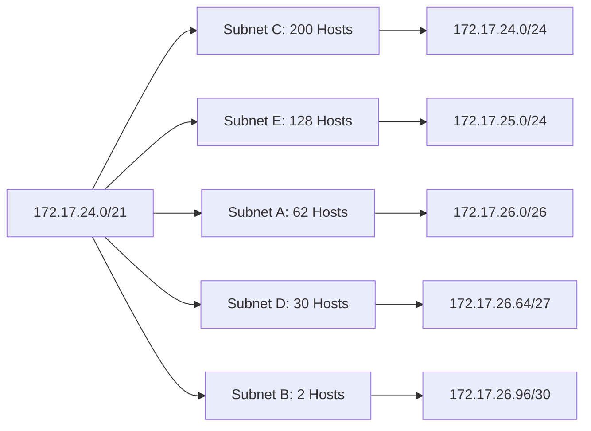

# 2. VLSM Subnetting (TD 02)

## Part 1: Lab Statement (Questions)

**Module:** Advanced Networks
**Level:** Master 1 (GL-IA)
**Year:** 2025-2026

### Exercise 01: FLSM vs. VLSM
Let a network with address `204.15.5.0/24` be constituted of 5 subnets A, B, C, D, and E, with the following requirements:
*   Subnet A: 14 equipments
*   Subnet B: 28 equipments
*   Subnet C: 2 equipments
*   Subnet D: 7 equipments
*   Subnet E: 28 equipments

1.  Using **FLSM** (Fixed Length Subnet Mask), propose a corresponding addressing plan.
2.  Calculate the utilization rate of the addresses previously assigned to each of the 5 subnets.
3.  What can be concluded?
4.  Propose an **optimal** addressing plan (reducing address waste).

### Exercise 02: Topology Based VLSM
The address space `173.18.192.0/20` is made available for your network design. VLSM will be used to meet the addressing requirements described by the following topology:

*   **PC2 LAN:** 2000 hosts
*   **PC0 LAN:** 500 hosts
*   **PC1 LAN:** 300 hosts
*   **PC6 LAN:** 50 hosts
*   **Hub0 LAN:** 100 hosts
*   **Router Links:** Interconnections between routers.

1.  Determine all the subnets in this topology.
2.  Establish the corresponding addressing plan (for each subnet, indicate its subnet address, the subnet mask, the first and last usable addresses, and the broadcast address).

### Exercise 03: ISP & Expansion
The VLSM technique will be used to meet the addressing requirements of your enterprise network, consisting of the following segments:
*   LAN1 must support 1500 hosts.
*   LAN2 must support 800 hosts.
*   A point-to-point link.

1.  Which address should you buy from your Internet Service Provider (ISP) to best meet the current requirements of your company; knowing that the ISP has the following addresses available: `120.15.64.0/21`; `120.15.64.0/19`; `120.15.64.0/18`? Explain.
2.  Establish the corresponding addressing plan.
3.  The company is in full expansion. It is proposed to add 3 local networks: LAN3, LAN4, and LAN5, capable of supporting 1500 hosts, 500 hosts, and 100 hosts respectively. Two serial point-to-point links are necessary to connect these 3 subnets to the existing network. Complete the existing addressing plan to support this evolution.

### Exercise 04: Aggregation & Subdivision
A company is assigned the network address `172.17.0.0/19`. It wishes to split its network into 5 subnets of the **same size** to assign them to different sites.

1.  Give the subnet mask resulting from this decomposition.
2.  For each of the addresses listed below, give the address of the subnet to which they belong:
    *   `172.17.6.210`
    *   `172.17.18.1`
    *   `172.17.0.254`
    *   `172.17.12.25`
    *   `172.17.5.50`

The company now wishes to **aggregate** the **last two** subnet addresses resulting from the decomposition of its network in order to obtain a network address capable of hosting a larger number of machines. You will take the last two unassigned subnet addresses.

3.  What is the network address resulting from this aggregation?
4.  We now wish to subdivide the network address resulting from this aggregation to create 5 **new** subnets denoted A, B, C, D, and E. Using **VLSM**, propose an addressing plan that satisfies the needs of each subnet.
    The number of machines that these subnets must host is as follows:
    *   Subnet A: 62 equipments
    *   Subnet B: 2 equipments
    *   Subnet C: 200 equipments
    *   Subnet D: 30 equipments
    *   Subnet E: 128 equipments

---

## Part 2: Detailed Solutions & Explanations

### 1. Solution - Exercise 01: FLSM vs VLSM

**Network:** `204.15.5.0/24` (Class C).
**Total Hosts available:** $2^8 - 2 = 254$.

#### 1. FLSM Addressing Plan (Fixed Length)

> [!INFO] Concept: FLSM
> In FLSM, all subnets must have the **same mask**. The mask is determined by the subnet with the **highest** requirement.

*   **Max Requirement:** Subnets B and E need **28** hosts.
*   **Calculation:**
    We need $h$ host bits such that $2^h - 2 \ge 28$.
    $2^5 = 32$ ($32-2=30$).
    So, **5 host bits** are required.
*   **Subnet Bits:**
    Original Mask: /24.
    New Mask: $32 - 5 = /27$.
    Borrowed bits: $27 - 24 = 3$ bits.
*   **Number of Subnets:** $2^3 = 8$ possible subnets. (We need 5, so this fits).
*   **Block Size:** $2^5 = 32$.

**FLSM Table:**

| Subnet | Needs | Address | Mask | Range | Broadcast |
| :--- | :--- | :--- | :--- | :--- | :--- |
| A | 14 | 204.15.5.0 | /27 | .1 - .30 | .31 |
| B | 28 | 204.15.5.32 | /27 | .33 - .62 | .63 |
| C | 2 | 204.15.5.64 | /27 | .65 - .94 | .95 |
| D | 7 | 204.15.5.96 | /27 | .97 - .126 | .127 |
| E | 28 | 204.15.5.128| /27 | .129 - .158| .159 |

#### 2. Utilization Rate (Efficiency)

Formula: $\text{Rate} = (\text{Hosts Used} / \text{Total Capacity}) \times 100$
*Capacity per subnet is 30 usable IPs.*

*   **SR A:** $(14 / 30) \times 100 = 46.67\%$
*   **SR B:** $(28 / 30) \times 100 = 93.33\%$
*   **SR C:** $(2 / 30) \times 100 = 6.67\%$
*   **SR D:** $(7 / 30) \times 100 = 23.33\%$
*   **SR E:** $(28 / 30) \times 100 = 93.33\%$

#### 3. Conclusion
FLSM is efficient for subnets B and E (matched to the size), but results in massive **waste** for subnets C (point-to-point) and D. We are wasting almost an entire /27 block for just 2 hosts.

#### 4. Optimal Plan (VLSM)

> [!TIP] VLSM Rule
> Always sort the subnets from **Largest** to **Smallest** requirement before assigning addresses. This prevents fragmentation errors.

**Sorted Requirements:**
1.  **B:** 28 hosts $\rightarrow$ Needs 5 bits ($2^5=32$) $\rightarrow$ **/27**
2.  **E:** 28 hosts $\rightarrow$ Needs 5 bits ($2^5=32$) $\rightarrow$ **/27**
3.  **A:** 14 hosts $\rightarrow$ Needs 4 bits ($2^4=16$) $\rightarrow$ **/28**
4.  **D:** 7 hosts $\rightarrow$ Needs 4 bits ($2^4=16$) $\rightarrow$ **/28**
5.  **C:** 2 hosts $\rightarrow$ Needs 2 bits ($2^2=4$) $\rightarrow$ **/30**

**Assignment Logic:**
*   Start at `.0`.
*   Assign B (size 32): `0` to `31`. Next available: `32`.
*   Assign E (size 32): `32` to `63`. Next available: `64`.
*   Assign A (size 16): `64` to `79`. Next available: `80`.
*   Assign D (size 16): `80` to `95`. Next available: `96`.
*   Assign C (size 4): `96` to `99`.

**VLSM Table:**

| Subnet | Needs | CIDR | Address | Range | Broadcast |
| :--- | :--- | :--- | :--- | :--- | :--- |
| **B** | 28 | /27 | 204.15.5.0 | .1 - .30 | .31 |
| **E** | 28 | /27 | 204.15.5.32 | .33 - .62 | .63 |
| **A** | 14 | /28 | 204.15.5.64 | .65 - .78 | .79 |
| **D** | 7 | /28 | 204.15.5.80 | .81 - .94 | .95 |
| **C** | 2 | /30 | 204.15.5.96 | .97 - .98 | .99 |

---

### 2. Solution - Exercise 02: Topology VLSM

**Root Network:** `173.18.192.0/20`
*   Range: `173.18.192.0` to `173.18.207.255`.

**1. Determine Subnets & Sort by Size**

Looking at the diagram, we identify LANs by host count and WAN links (Router-Router or Router-Switch). *Assuming 1 WAN link between routers and specific host subnets.*

1.  **LAN PC2:** 2000 hosts.
    *   Need: $2^{11} = 2048$ ($2048-2 \ge 2000$).
    *   Bits: 11 host bits.
    *   Mask: $32 - 11 = /21$.
2.  **LAN PC0:** 500 hosts.
    *   Need: $2^9 = 512$.
    *   Bits: 9 host bits.
    *   Mask: $32 - 9 = /23$.
3.  **LAN PC1:** 300 hosts.
    *   Need: $2^9 = 512$ (256 is too small).
    *   Bits: 9 host bits.
    *   Mask: $32 - 9 = /23$.
4.  **LAN Hub0:** 100 hosts.
    *   Need: $2^7 = 128$.
    *   Bits: 7 host bits.
    *   Mask: $32 - 7 = /25$.
5.  **LAN PC6:** 50 hosts.
    *   Need: $2^6 = 64$.
    *   Bits: 6 host bits.
    *   Mask: $32 - 6 = /26$.
6.  **WAN Links:** (Assuming 3 point-to-point links based on lines between routers).
    *   Need: 2 hosts.
    *   Mask: /30.

**2. Addressing Plan**

*Start Address:* `173.18.192.0`

1.  **PC2 (Size 2048 - /21):**
    *   Address: `173.18.192.0/21`.
    *   Range: 192.0 to 199.255.
    *   *Next IP:* `173.18.200.0`.

2.  **PC0 (Size 512 - /23):**
    *   Address: `173.18.200.0/23`.
    *   Range: 200.0 to 201.255.
    *   *Next IP:* `173.18.202.0`.

3.  **PC1 (Size 512 - /23):**
    *   Address: `173.18.202.0/23`.
    *   Range: 202.0 to 203.255.
    *   *Next IP:* `173.18.204.0`.

4.  **Hub0 (Size 128 - /25):**
    *   Address: `173.18.204.0/25`.
    *   Range: 204.1 to 204.126.
    *   Broadcast: 204.127.
    *   *Next IP:* `173.18.204.128`.

5.  **PC6 (Size 64 - /26):**
    *   Address: `173.18.204.128/26`.
    *   Range: 204.129 to 204.190.
    *   Broadcast: 204.191.
    *   *Next IP:* `173.18.204.192`.

6.  **WAN Links (Size 4 - /30):**
    *   Link 1: `173.18.204.192/30`.
    *   Link 2: `173.18.204.196/30`.
    *   Link 3: `173.18.204.200/30`.

---

### 3. Solution - Exercise 03: ISP Selection

**1. Choice of ISP Address**
*   **Needs:**
    *   LAN1: 1500 hosts $\rightarrow$ Needs $2^{11} = 2048$ block (/21).
    *   LAN2: 800 hosts $\rightarrow$ Needs $2^{10} = 1024$ block (/22).
    *   WAN: 2 hosts $\rightarrow$ Needs /30.
*   **Total Sum Calculation:**
    $2048 + 1024 + 4 = 3076$ addresses required roughly.
*   **Evaluate Options:**
    *   `/21` (2048 IPs): Too small. Covers LAN1 but nothing else.
    *   `/19` (8192 IPs): Plenty of space ($8192 > 3076$). Allows for growth.
    *   `/18` (16384 IPs): Too large / expensive.
*   **Decision:** Buy **120.15.64.0/19**.

**2. Initial Plan (Root: 120.15.64.0)**
1.  **LAN1 (1500):** `120.15.64.0/21`. (Ends at 71.255). Next: 72.0.
2.  **LAN2 (800):** `120.15.72.0/22`. (Ends at 75.255). Next: 76.0.
3.  **WAN:** `120.15.76.0/30`.

**3. Expansion**
*   **New Needs:**
    *   LAN3 (1500) $\rightarrow$ /21.
    *   LAN4 (500) $\rightarrow$ /23.
    *   LAN5 (100) $\rightarrow$ /25.
    *   2 x WAN $\rightarrow$ /30.
*   **Placement (Continuing from 76.4):**
    Ideally, we re-sort to keep large blocks aligned, but let's append if space permits (we have up to .95 in the /19).
    *   *Current Used:* up to 76.3.
    *   *Next block:* 76.4 is not aligned for a /21. A /21 must start on a multiple of 8 in the 3rd octet (64, 72, 80...).
    *   **Jump to next /21 boundary:** `120.15.80.0`.
    *   **LAN3:** `120.15.80.0/21` (Ends 87.255).
    *   **LAN4:** `120.15.88.0/23` (Ends 89.255).
    *   **LAN5:** `120.15.90.0/25`.
    *   **WANs:** Fill in the gaps (e.g., at 76.4, 76.8).

---

### 4. Solution - Exercise 04: Aggregation & Subdivision

**Root:** `172.17.0.0/19`.

#### 1. First Split (Equal Size)
*   **Goal:** 5 subnets.
*   **Bits:** $2^n \ge 5 \rightarrow n=3$ bits borrowed.
*   **New Mask:** $/19 + 3 = /22$.
*   **Decimal Mask:** `255.255.252.0`.
*   **Block Increment:** $2^2 = 4$ in the 3rd octet.

**Subnets Created:**
1.  **S0:** `172.17.0.0/22` (Range: 0.0 - 3.255)
2.  **S1:** `172.17.4.0/22` (Range: 4.0 - 7.255)
3.  **S2:** `172.17.8.0/22` (Range: 8.0 - 11.255)
4.  **S3:** `172.17.12.0/22` (Range: 12.0 - 15.255)
5.  **S4:** `172.17.16.0/22` (Range: 16.0 - 19.255)
6.  *Unused:* `172.17.20.0/22`
7.  *Unused:* `172.17.24.0/22`
8.  *Unused:* `172.17.28.0/22`

#### 2. Address Mapping

| IP Address | 3rd Octet | Range Check | Subnet |
| :--- | :--- | :--- | :--- |
| `172.17.6.210` | 6 | Between 4 and 7 | **S1 (172.17.4.0/22)** |
| `172.17.18.1` | 18 | Between 16 and 19 | **S4 (172.17.16.0/22)** |
| `172.17.0.254` | 0 | Between 0 and 3 | **S0 (172.17.0.0/22)** |
| `172.17.12.25` | 12 | Between 12 and 15 | **S3 (172.17.12.0/22)** |
| `172.17.5.50` | 5 | Between 4 and 7 | **S1 (172.17.4.0/22)** |

#### 3. Aggregation

The question asks to aggregate the **"last two subnets resulting from the decomposition... unassigned"**.
Looking at the /19 split (0, 4, 8, 12, 16, 20, 24, 28).
The last two are `172.17.24.0/22` and `172.17.28.0/22`.

*   **Binary Analysis (3rd Octet):**
    *   24: `0001 1000`
    *   28: `0001 1100`
    *   Difference is in the bit worth '4'.
    *   Common Prefix: `0001 1...` (5 bits).
    *   Total Prefix: $16 (\text{Octets 1,2}) + 5 = 21$.
*   **Result:** `172.17.24.0/21`.
    *(Note: /21 covers 24.0 to 31.255, which exactly includes the 24.0/22 and 28.0/22 blocks).*

#### 4. VLSM on Aggregated Block (172.17.24.0/21)

**Requirements (Sorted):**
1.  **C:** 200 hosts $\rightarrow$ Needs 8 bits ($2^8=256$) $\rightarrow$ **/24**
2.  **E:** 128 hosts $\rightarrow$ Needs 8 bits ($2^8=256$, because $2^7=128-2=126$ is too small) $\rightarrow$ **/24**
3.  **A:** 62 hosts $\rightarrow$ Needs 6 bits ($2^6=64$) $\rightarrow$ **/26**
4.  **D:** 30 hosts $\rightarrow$ Needs 5 bits ($2^5=32$) $\rightarrow$ **/27**
5.  **B:** 2 hosts $\rightarrow$ Needs 2 bits ($2^2=4$) $\rightarrow$ **/30**

**Assignment (Start at 172.17.24.0):**

**Detailed Table:**

| Subnet | Needs | Mask | Network Addr | First IP | Last IP | Broadcast |
| :--- | :--- | :--- | :--- | :--- | :--- | :--- |
| **C** | 200 | /24 | **172.17.24.0** | .24.1 | .24.254 | .24.255 |
| **E** | 128 | /24 | **172.17.25.0** | .25.1 | .25.254 | .25.255 |
| **A** | 62 | /26 | **172.17.26.0** | .26.1 | .26.62 | .26.63 |
| **D** | 30 | /27 | **172.17.26.64** | .26.65 | .26.94 | .26.95 |
| **B** | 2 | /30 | **172.17.26.96** | .26.97 | .26.98 | .26.99 |