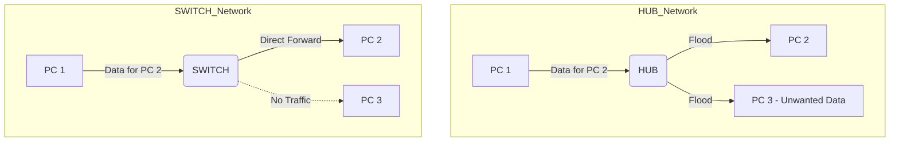

# 01 - Packet Tracer Basics & Physical Connectivity

## 📌 Overview

This note covers the fundamentals of Cisco Packet Tracer (CPT), how to physically connect devices, and the crucial difference between a **Hub** and a **Switch**.

## 🛠️ The Packet Tracer Interface

Packet Tracer allows us to simulate networking without buying hardware.

1.  **Logical Workspace:** The big white area where you build the network.
2.  **Device Selection Box (Bottom Left):**
    - **Routers:** Circular icons.
    - **Switches:** Square icons (Standard model: 2960).
    - **End Devices:** PCs, Laptops, Servers.
    - **Connections:** The lightning bolt icon (Cables).

### ⚙️ Device Configuration Tabs

When you click on a device (e.g., a PC), you see:

- **Physical:** Add/remove hardware modules (Power off device first!).
- **Config:** GUI-based configuration (easy mode, but rarely used in real life).
- **Desktop:** Simulation of OS apps (IP Configuration, Command Prompt, Browser).
- **CLI (Command Line Interface):** The text console used to code Routers/Switches.

---

## 🔌 Cabling: The "Physical Layer"

Choosing the wrong cable is the #1 mistake beginners make.

### 1. Straight-Through Cable (Solid Black Line)

- **Use when:** Connecting **different** types of devices.
- **Examples:**
  - PC ↔ Switch
  - Switch ↔ Router
  - Hub ↔ PC

### 2. Cross-Over Cable (Dashed Black Line)

- **Use when:** Connecting **similar** types of devices.
- **Examples:**
  - PC ↔ PC
  - Switch ↔ Switch
  - Router ↔ Router
  - PC ↔ Router (Direct connection)
  - _Exception:_ Hub ↔ Switch (Technically similar layers).

### 3. Console Cable (Blue Curve)

- **Use when:** Configuring a Switch/Router for the first time from a PC.
- **Connection:** Connects PC (RS-232/Serial Port) ↔ Switch (Console Port).
- **Note:** This does **not** send network data (no internet). It only sends text commands to configure the device.

> 💡 **Tip:** In modern devices, "Auto-MDIX" detects the cable type automatically. However, in exams and Packet Tracer, you **must** pick the correct cable manually.

---

## 🧠 Concept: Hub vs. Switch

Both devices connect multiple PCs, but they function very differently.

### The Hub (Layer 1 - Dumb Device)

- **Function:** It is a "Repeater." When it receives data on Port 1, it blindly copies it and sends it out to **ALL** other ports.
- **Result:** High traffic, security risk (everyone sees everything), and **Collisions**.
- **Simulation Mode:** You will see the message envelope burn (collision) or go to everyone (red X on devices not meant to receive it).

### The Switch (Layer 2 - Smart Device)

- **Function:** It learns. It keeps a **MAC Address Table**.
- **Process:**
  1.  PC A sends data to PC B.
  2.  Switch looks at its table: "Where is PC B?"
  3.  If known, it sends data **ONLY** to the port connected to PC B.
- **Result:** Faster, secure, no collisions.

---

## 🧪 Lab Exercise: Creating the First LAN

**Objective:** Connect 3 PCs to a Switch (from TP01).

### Steps:

1.  **Place Devices:** Drag 3 PCs and 1 Switch (2960-24TT) to the workspace.
2.  **Connect:** Select **Straight-Through Cable**.
    - Click PC1 > FastEthernet0 > Click Switch > FastEthernet0/1.
    - Repeat for PC2 (Fa0/2) and PC3 (Fa0/3).
3.  **Wait for Green:** You will see orange dots. This is STP (Spanning Tree Protocol) checking for loops. Wait 30 seconds for them to turn **Green**.

### IP Configuration

Devices need logical addresses to talk.

1.  Click PC1 > Desktop > IP Configuration.
2.  Set **Static IP**.
    - PC1: `192.168.2.1` / Subnet Mask: `255.255.255.0`
    - PC2: `192.168.2.2`
    - PC3: `192.168.2.3`

### Verification (Ping)

1.  Open PC1 > Desktop > Command Prompt.
2.  Type: `ping 192.168.2.2`
3.  **Success:** "Reply from 192.168.2.2: bytes=32..."
4.  **Failure:** "Request timed out." (Check IP typing or Cable type).

### Simulation Mode (The "Why" Button)

1.  Switch to **Simulation Mode** (Bottom right, behind Realtime).
2.  Click the **Envelope (PDU)** icon.
3.  Click PC1 (Source) then PC3 (Dest).
4.  Click **Play**.
5.  **Observe:** The switch receives the packet. If it's the first time, it might flood (ARP request). Afterward, it sends it directly to PC3.

> 📝 **Important Reminder:** If you replace the Switch with a **Hub**, the packet will go to PC2 AND PC3. PC2 will reject it (firewall/NIC drop), but it still occupies the line.
