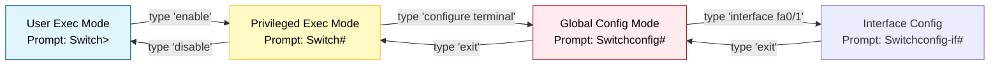

# 02 - Switch Configuration (CLI & Security)

## 📌 Background Knowledge
A fresh Cisco Switch has no password and a default name ("Switch"). To secure it, we use the **CLI (Command Line Interface)**.
In Packet Tracer, click the Switch > **CLI** tab.

### The 3 Main Modes of IOS
You cannot just type any command anywhere. You must be in the correct "room" (mode).



---

## 💻 Essential Configuration Commands

### 1. Entering Global Configuration
Always start here to make changes.
```cisco
Switch> enable
Switch# configure terminal
Switch(config)# 
```

`cisco config t` (or `configure terminal`) is the command to enter **Global Configuration Mode**

### 2. Hostname
Give the device a unique identity.
```cisco
Switch(config)# hostname S1
S1(config)#
```
*(Notice the prompt changed from Switch to S1).*

### 3. Securing the Console (Physical Access)
This password protects someone plugging a blue cable into the switch physically.
```cisco
S1(config)# line console 0
S1(config-line)# password 1234
S1(config-line)# login
S1(config-line)# exit
```
> ⚠️ **Common Mistake:** Forgetting the command `login`. If you set a password but don't type `login`, the switch will never ask for it!

### 4. Securing Privileged Mode (Remote/Admin Access)
This is the most important password. It stops users from typing `enable` to become super-users.
```cisco
S1(config)# enable password 5678    <-- Stored in plain text (Weak)
S1(config)# enable secret cisco     <-- Encrypted (Strong/Best Practice)
```
*Note: If you use both, `secret` overrides `password`.*

### 5. Encrypting All Passwords
The console password is visible if you do `show run`. To hide it:
```cisco
S1(config)# service password-encryption
```

### 6. Banner Message
Legal warning for hackers connecting to the device.
```cisco
S1(config)# banner motd # ACCESS RESTRICTED TO AUTHORIZED PERSONNEL #
```
*(The `#` symbol acts as the start and stop delimiter).*

---

## 💾 Saving Your Work
In Cisco devices, configuration happens in **RAM** (Running Config). If the power cuts, **everything is lost**. You must save to **NVRAM** (Startup Config).

**Command (Must be done in Privileged Mode `S1#`):**
```cisco
S1# copy running-config startup-config
Destination filename [startup-config]? [Enter]
Building configuration...
[OK]
```
*Shortcut:* `write` (or just `wr`) works on older IOS versions.

---

## 🔍 Verification Commands
Used in Privileged Mode (`S1#`) to check your work.

| Command | Description |
| :--- | :--- |
| `show running-config` | Shows the current active configuration (passwords, interfaces). |
| `show startup-config` | Shows the saved configuration in NVRAM. |
| `show version` | Hardware info, IOS version, uptime. |
| `show mac-address-table` | Shows which MAC address is on which port (The Switch's "brain"). |

### Understanding the MAC Address Table
When you run `show mac-address-table`, you might see:
```text
Vlan    Mac Address       Type       Ports
----    -----------       --------   -----
   1    0040.0b8c.d690    DYNAMIC    Fa0/2
```
*   **Reasoning:** The switch learned that the device with MAC `0040...` is plugged into port `Fa0/2`.
*   **Dynamic:** Learned automatically by listening to traffic.

---

## 🧪 Lab Exercise: Apply & Verify
**Task:** Configure the Switch from the previous note.
1.  Connect PC to Switch via **Console Cable** (PC RS232 -> Switch Console).
2.  On PC: Desktop > Terminal > OK.
3.  Perform the configuration steps above (Hostname, Console Pass, Enable Pass).
4.  Exit all the way out (`exit` twice).
5.  **Test:** Press Enter. It should ask for the Console password (`1234`). Type `enable`. It should ask for the Enable password (`5678` or `cisco`).
