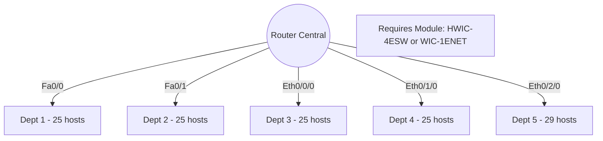
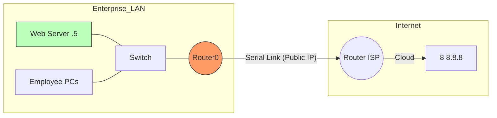

## 📌 TP01/TP02: Basic Interconnection
Two distinct LANs connected by a single Router.

```mermaid
graph LR
    subgraph LAN_1 [Network 192.168.1.0/24]
        PC0[PC0] --- SW1[Switch 2960]
        PC1[PC1] --- SW1
        SW1 ---|Fa0/0 - 192.168.1.100| R1
    end

    R1((Router))

    subgraph LAN_2 [Network 172.16.1.0/24]
        R1 ---|Fa0/1 - 172.16.1.100| SW2[Switch 2960]
        SW2 --- PC2[PC2]
        SW2 --- PC3[PC3]
    end
````

---

## 📌 TP03 Part II: WAN Connection (Campus Sud to Nord)

Connecting two routers via a Serial Cable (DCE/DTE).

```mermaid
graph LR
    subgraph Campus_SUD
        L1[LAN Sud] --- R0((Router0))
    end

    R0 == Serial Link (10.10.10.0/30) ==> R1((Router1))

    subgraph Campus_NORD
        R1 --- L2[LAN Nord]
    end

    style R0 fill:#f9f,stroke:#333
    style R1 fill:#f9f,stroke:#333
    note[Note: R0 is DCE, needs clock rate 64000]
```

---

## 📌 TP03 Part I: The Star Topology (5 Departments)

A central router with 5 legs. Since standard routers only have 2 ports, you must add **WIC Modules**.



---

## 📌 TP04: NAT & Internet Simulation

Connecting the Corporate Network to the ISP.


