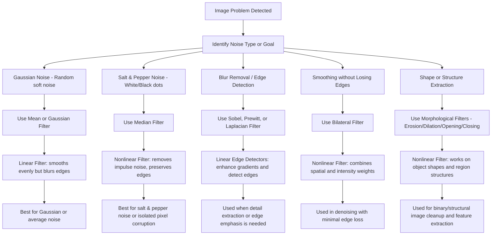

# **Image Filtering: Choosing the Right Filter**

---

## **1. Overview Mermaid Chart**

---

## **2. Filter Selection Table**

| **Filter Type**                 | **Category**      | **Best For**                                       | **Fails / Not Effective On**         | **Effect on Image**                    | **Notes**                                        |
| ------------------------------- | ----------------- | -------------------------------------------------- | ------------------------------------ | -------------------------------------- | ------------------------------------------------ |
| **Mean (Average)**              | Linear            | Removing **Gaussian noise**, basic smoothing       | **Salt & pepper noise**, sharp edges | Blurs the entire image, reduces detail | Simple and fast but removes texture              |
| **Gaussian Filter**             | Linear            | Reducing **Gaussian noise** smoothly               | Impulse noise (salt & pepper)        | Soft blur, gentle edge loss            | More natural blur than mean                      |
| **Median Filter**               | Nonlinear         | Removing **salt & pepper noise**, impulsive noise  | Gaussian noise (blurry noise)        | Removes dots, keeps edges crisp        | Most common denoiser for binary/grayscale images |
| **Min Filter (Erosion)**        | Nonlinear         | Removing small **white** noise (bright pixels)     | Dark noise or general blur           | Shrinks white regions                  | Useful for morphological cleaning                |
| **Max Filter (Dilation)**       | Nonlinear         | Removing small **black** noise (dark pixels)       | Bright noise or textures             | Expands white regions                  | Used in morphological restoration                |
| **Morphological Opening**       | Nonlinear         | Removing small **bright** objects                  | Dark noise                           | Erodes then dilates                    | Used in binary and mask cleanup                  |
| **Morphological Closing**       | Nonlinear         | Filling **small dark holes**                       | White noise                          | Dilates then erodes                    | Connects nearby structures                       |
| **High-Pass Filter**            | Linear            | Enhancing **edges and details**                    | Noisy images                         | Sharpens edges but amplifies noise     | Used in sharpening pipelines                     |
| **Low-Pass Filter**             | Linear            | **Blurring** and removing high-frequency noise     | Preserving texture and edges         | Smooths image                          | Used in background extraction                    |

---
# **Filtrage d’Images : Domaines Spatiaux et Fréquentiels**

---

## **1. Types de Bruit**

| Type de bruit | Description | Exemple de filtre recommandé |
|---------------|------------|----------------------------|
| Bruit gaussien (additif) | Variation douce et aléatoire des intensités | Moyenne, Gaussien (filtre linéaire) |
| Bruit impulsionnel (Poivre et Sel) | Points noirs/blancs isolés | Médian, Nagao (filtres non linéaires) |
| Nagao | Adaptatif pour le lissage local | Filtre Nagao |

---

## **2. Filtrage dans le Domaine Fréquentiel**

### **2.1 Concepts**

- Les images sont transformées en **espace des fréquences** via la **Transformée de Fourier Discrète (TFD / FFT)**.
- Le filtrage consiste à appliquer des filtres dans le domaine fréquentiel, puis revenir dans le domaine spatial avec **FFT⁻¹**.

### **2.2 Types de filtres fréquentiels**

| Type de filtrage | Objectif | Remarques |
|-----------------|----------|------------|
| Passe-bas | Lissage, élimination du bruit | Atténue les hautes fréquences |
| Passe-haut | Détection des contours | Supprime les basses fréquences |
| Coupe-bande | Sélection ou suppression d’une bande spécifique (HF ou BF) | Utilisé pour filtrer certaines textures |
| Filtre de Gabor | Cibler zones spécifiques dans le spectre | Très utilisé en texture et reconnaissance de motifs |

---

## **3. Filtrage dans le Domaine Spatial (Cartésien)**

- Se fait directement sur les pixels.
- Comprend **filtres linéaires** et **non linéaires**.

### **3.1 Filtre Linéaire**

- Réalisable par **convolution** : $g(x, y) = f(x, y) \ast filtre(x, y)$

- Exemples : Moyenneur, Gaussien.
- Effets : lissage, atténuation des hautes fréquences.

### **3.2 Filtre Non Linéaire**

- Pas réalisable par convolution simple.
- Exemples : Médian, Moyen adaptatif, Nagao, Max/Min.
- Effets : supprime le bruit impulsionnel tout en préservant les contours.

---

## **4. Exemples de Filtres Spatiaux**

### **4.1 Filtre Moyenneur**

- Filtre linéaire passe-bas.
- Atténue les variations rapides (hautement fréquentielles) mais **floute les contours**.

### **4.2 Filtre Gaussien**

- Filtre linéaire basé sur la fonction gaussienne.
- 1D : lissage sur un signal unidimensionnel.
- 2D : lissage sur image :

$$
G(x,y) = \frac{1}{2 \pi \sigma^2} e^{-\frac{x^2 + y^2}{2\sigma^2}}
$$

- Avantage : plus naturel que le filtre moyen, contours légèrement préservés.

### **4.3 Filtre Médian**

- Filtre non linéaire d’ordre.
- Remplace chaque pixel par la **valeur médiane** de son voisinage.
- Efficace pour le **bruit impulsionnel**.
- Préserve mieux les **contours** par rapport aux filtres linéaires.

### **4.4 Filtre Adaptatif Nagao**

- Filtre non linéaire local.
- Analyse plusieurs sous-régions autour du pixel.
- Sélectionne la moyenne locale la plus homogène.
- Bon pour **préserver les détails tout en réduisant le bruit**.

---

## **5. Comparaison Rapide : Filtre Moyen vs Médian**

| Propriété | Filtre Moyen (Lin.) | Filtre Médian (Non lin.) |
|-----------|-------------------|-------------------------|
| Type | Linéaire | Non linéaire |
| Bruit ciblé | Bruit gaussien | Bruit impulsionnel |
| Effet sur contours | Floute les bords | Contours préservés |
| Complexité | Faible | Moyenne à élevée |
| Utilisation | Lissage général | Nettoyage bruit ponctuel |

---

### **6. Remarques**

- **Filtrage spatial** → traitement direct des pixels.
- **Filtrage fréquentiel** → traitement dans le domaine des fréquences, utile pour cibler certaines bandes et textures.
- **Choix du filtre** dépend du **type de bruit** et de la **préservation des contours**.
- **Filtres non linéaires** (Médian, Nagao) sont indispensables pour **bruit impulsionnel** et **préservation des détails**.

