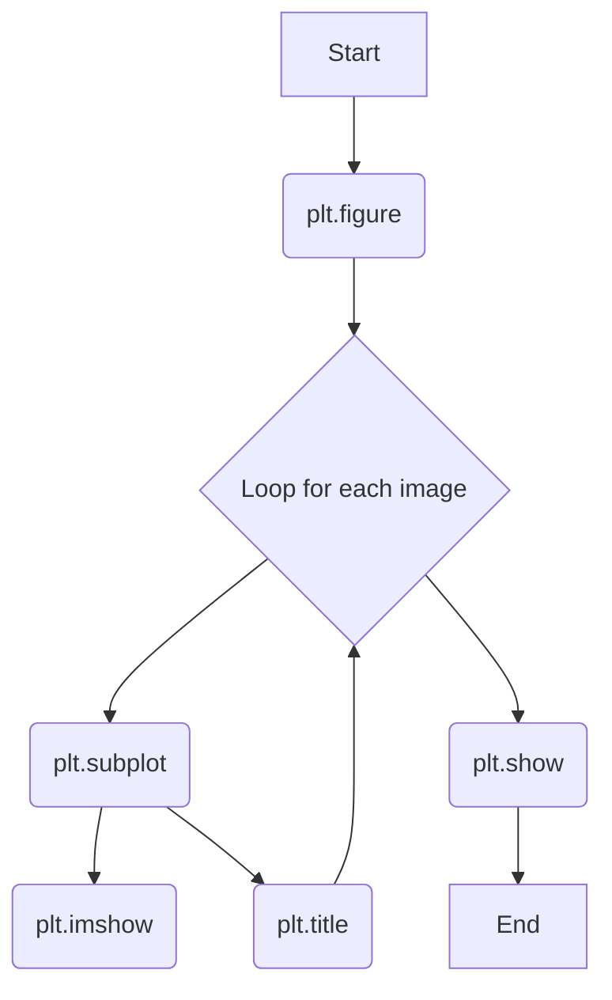

While `cv2.imshow()` is good for quickly displaying a single image, Matplotlib provides a more powerful and flexible system for creating figures with multiple plots, titles, and customizations. This is ideal for comparing images and creating figures for reports.

#Keywords
#Matplotlib #Plotting #subplot #figure

---

## The Standard Workflow

The lab scripts follow a standard pattern for creating a figure with multiple plots (or "axes").



1.  **`plt.figure()`**: Create a new figure (the main window). You can specify a `figsize` to control its dimensions.
2.  **`plt.subplot()`**: For each image you want to display, define a grid layout and select the next available subplot.
3.  **`plt.imshow()` / `plt.title()` etc.**: Use plotting functions to draw the image and add details to the *currently active* subplot.
4.  **`plt.show()`**: After setting up all the subplots, display the final figure.

---

### `plt.figure()`
Creates a figure object that acts as a container for all your plots.

| Parameter | Type | Description | Example from Lab |
| :--- | :--- | :--- | :--- |
| `figsize` | `tuple` | (Optional) A tuple `(width, height)` specifying the figure size in inches. | `(15, 5)` |

### `plt.subplot()`
This is the key to creating a grid of plots. It divides the figure into a grid and activates a specific cell for plotting.

| Parameter | Type | Description |
| :--- | :--- | :--- |
| `nrows` | `int` | Total number of rows in the grid. |
| `ncols` | `int` | Total number of columns in the grid. |
| `index` | `int` | The index of the subplot to activate. **Index starts at 1**. |

#### Example from Lab (`exercise_1`)
To display three images side-by-side, you create a 1x3 grid.

```python
# --- First Image ---
# Activate the 1st plot in a 1 row, 3 column grid
plt.subplot(1, 3, 1) 
plt.imshow(im1, cmap='gray')

# --- Second Image ---
# Activate the 2nd plot in the 1x3 grid
plt.subplot(1, 3, 2)
plt.imshow(im2, cmap='gray')

# --- Third Image ---
# Activate the 3rd plot in the 1x3 grid
plt.subplot(1, 3, 3)
plt.imshow(im3, cmap='gray')
```

### Other Useful Functions
- **`plt.suptitle("...")`**: Adds a centered title for the entire figure.
- **`plt.tight_layout()`**: Automatically adjusts subplot spacing to prevent titles and labels from overlapping.
- **`plt.axis('off')`**: Hides the X and Y axis lines and labels, which is common for image display.