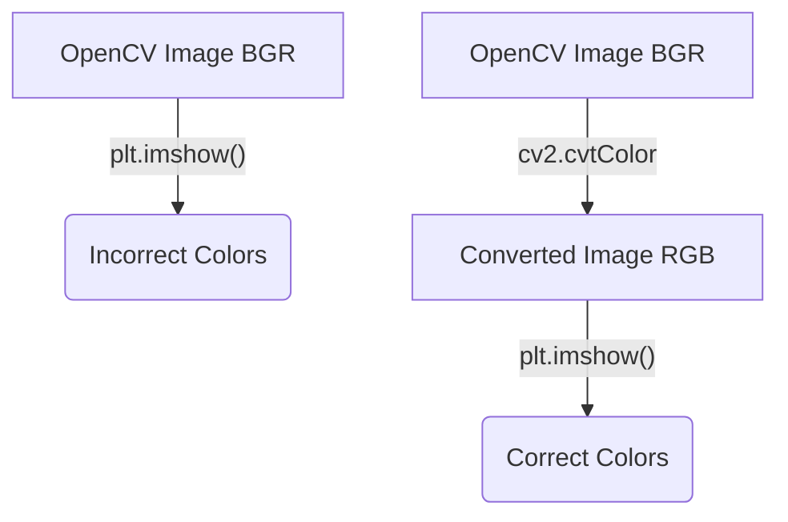

The `plt.imshow()` function is Matplotlib's primary tool for displaying image data. However, there are two critical details to be aware of when using it with OpenCV: the **color map** for grayscale images and the **channel order** for color images.

#Keywords
#Matplotlib #imshow #cmap #RGB #BGR

---

### `plt.imshow()`
This function renders a NumPy array as an image on the currently active subplot.

| Parameter | Type | Description |
| :--- | :--- | :--- |
| `X` | `ndarray` | The image data. Can be 2D (grayscale) or 3D (color). |
| `cmap` | `string` | (Optional) The **color map** to use for 2D data. |
| `interpolation` | `string` | (Optional) The algorithm used to blend pixels if the display size is different from the image size. |

---

## 1. Grayscale Images and `cmap`

When you give `plt.imshow()` a 2D NumPy array (a grayscale image), it doesn't know whether to render it as shades of gray or as a "heatmap". By default, it uses a heatmap color map (like 'viridis'), which results in false colors.

**You must explicitly tell it to use a gray color map.**

-   **Correct:** `plt.imshow(gray_image, cmap='gray')`

#### Example
```python
import cv2
import matplotlib.pyplot as plt

gray_img = cv2.imread('Images/cameraman.bmp', cv2.IMREAD_GRAYSCALE)

plt.figure(figsize=(10, 5))

# Incorrect: Displays with a false-color heatmap
plt.subplot(1, 2, 1)
plt.imshow(gray_img)
plt.title("Incorrect (No cmap)")

# Correct: Displays in shades of gray
plt.subplot(1, 2, 2)
plt.imshow(gray_img, cmap='gray')
plt.title("Correct (cmap='gray')")

plt.show()
```

---

## 2. Color Images: BGR vs. RGB

This is a classic source of confusion when using OpenCV and Matplotlib together.

-   **OpenCV** loads and stores color images in **BGR** (Blue, Green, Red) order.
-   **Matplotlib** expects and displays color images in **RGB** (Red, Green, Blue) order.

If you pass an image loaded by OpenCV directly to `plt.imshow()`, the red and blue channels will be swapped, and the colors will look wrong.



### The Solution: `cv2.cvtColor()`
Before displaying with Matplotlib, you must convert the image from BGR to RGB.

```python
import cv2
import matplotlib.pyplot as plt

# 1. Load image with OpenCV (it's in BGR order)
img_bgr = cv2.imread('Images/pepper.bmp')

# 2. Convert it from BGR to RGB for Matplotlib
img_rgb = cv2.cvtColor(img_bgr, cv2.COLOR_BGR2RGB)

plt.figure(figsize=(10, 5))

# Incorrect: Red and Blue are swapped
plt.subplot(1, 2, 1)
plt.imshow(img_bgr)
plt.title("Incorrect (BGR order)")

# Correct: Colors appear as expected
plt.subplot(1, 2, 2)
plt.imshow(img_rgb)
plt.title("Correct (RGB order)")

plt.show()
```