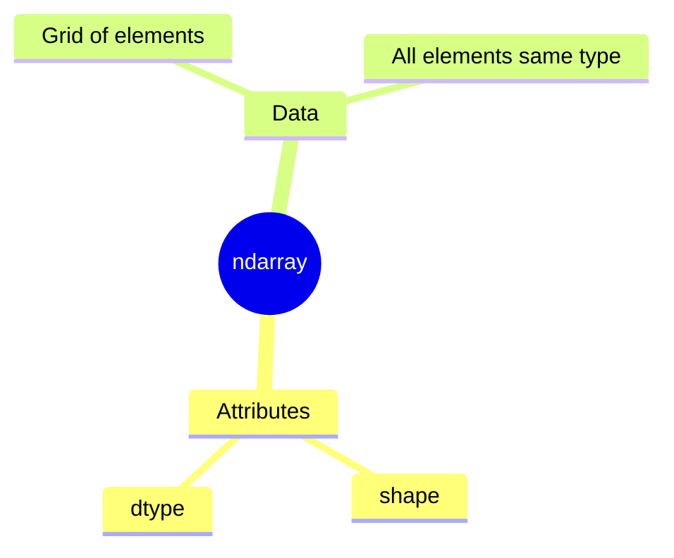

NumPy is the core library for numerical computing in Python. It is essential for image processing because **images are represented as NumPy `ndarrays`** (n-dimensional arrays).

#Keywords
#NumPy #ndarray #dtype #shape #ImageRepresentation

---

## The `ndarray` Object

A NumPy array is a grid of values, all of the same data type.



### Key Attributes for Images

1.  **`.shape`**: A tuple representing the array's dimensions.
    -   Grayscale Image: `(height, width)`
    -   Color Image: `(height, width, 3)`

2.  **`.dtype`**: The data type of the elements in the array. For images, this is almost always `np.uint8`.

---

## The `np.uint8` Data Type

This is the standard data type for 8-bit images, and it's important to understand what it means.

-   **`u`**: **Unsigned** - The values cannot be negative.
-   **`int`**: **Integer** - The values are whole numbers.
-   **`8`**: **8-bit** - The value can hold 2⁸ = 256 distinct values.

This combination gives a required value range of **[0, 255]**.

-   `0` represents black.
-   `255` represents white.
-   Intermediate values represent shades of gray or color channel intensities.

### Why it Matters
If you perform a calculation that results in a value outside this range (like `-10` or `300`), you must bring it back into the `[0, 255]` range before you can save or display the image correctly. This is where functions like `np.clip()` become essential.

```python
import numpy as np

# Create a dummy 1x3 pixel image (one row, three columns)
# The 'dtype' argument is crucial
image_row = np.array([[0, 128, 255]], dtype=np.uint8)

print(f"Shape: {image_row.shape}")
print(f"Data Type: {image_row.dtype}")

# What happens if we subtract 10?
# NumPy wraps the value around because it's an unsigned type!
# 0 - 10 should be -10, but it wraps to 246. This is usually NOT what we want.
new_row = image_row - 10
print(f"Incorrect subtraction result: {new_row}") 

# The correct way involves converting to a temporary float, clipping, and converting back
correct_row = np.clip(image_row.astype(np.float32) - 10, 0, 255).astype(np.uint8)
print(f"Correct subtraction result: {correct_row}")
```
This example shows why managing data types is critical in image processing.