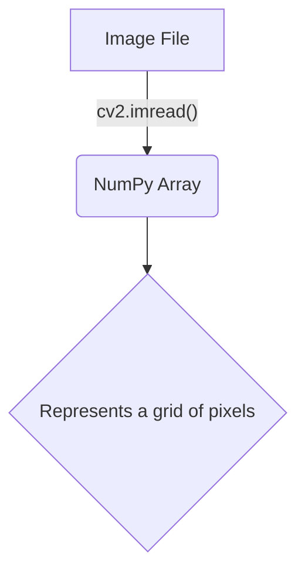
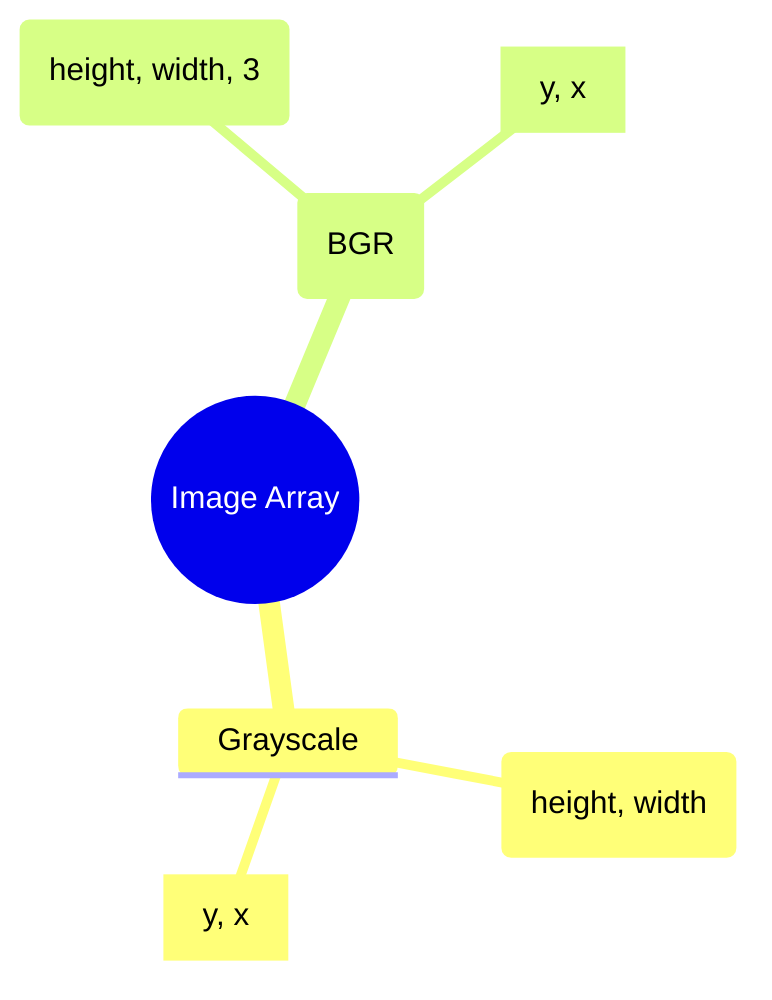

The most crucial concept in OpenCV is how it represents images. Understanding this is the foundation for everything else.

#Keywords
#OpenCV #ComputerVision #NumpyArray #ImageRepresentation

---

## Images as NumPy Arrays

OpenCV treats images as **NumPy arrays**. A NumPy array is a powerful and efficient grid of numbers. For an image, these numbers represent pixel data.



### Coordinate System

OpenCV uses a `(y, x)` coordinate system, which corresponds to `(row, column)`. The origin `(0, 0)` is at the **top-left corner** of the image.

### Image Types & Shapes

The `.shape` attribute of the NumPy array tells you the image's dimensions.

1.  **Grayscale Image:**
    - A 2-dimensional NumPy array.
    - Each element is a single value (0-255) for pixel intensity.
    - **Shape:** `(height, width)`

2.  **Color Image (BGR):**
    - A 3-dimensional NumPy array.
    - Each pixel has three values for the color channels.
    - **Important:** OpenCV loads colors in **BGR (Blue, Green, Red)** order by default.
    - **Shape:** `(height, width, 3)`



#### Example: Reading Image Shape

The `Lab_app.py` script demonstrates reading the shape and unpacking it into variables.

```python
import cv2

# Load a color image
img_color = cv2.imread('Images/BoatsColor.bmp') 

# The .shape attribute returns a tuple, e.g., (512, 512, 3)
# We use tuple unpacking to assign these values to variables
height, width, channels = img_color.shape

print(f"Height: {height} pixels")
print(f"Width: {width} pixels")
print(f"Channels: {channels}")
```