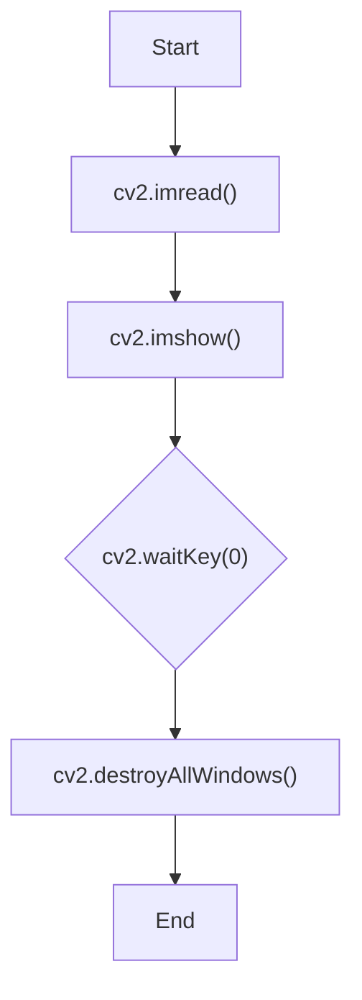

These are the fundamental functions for getting images into your application, displaying them, and handling user interaction.

#Keywords
#OpenCV #IO #imread #imshow #waitKey

---

### `cv2.imread()`
Reads an image from a file and returns it as a NumPy array.

| Parameter | Type | Description | Example from Lab |
| :--- | :--- | :--- | :--- |
| `filename` | `string` | The path to the image file. | `'Images/BoatsColor.bmp'` |
| `flags` | `int` | (Optional) Specifies the color type of the loaded image. If not provided, it defaults to loading a color image. | `cv2.IMREAD_GRAYSCALE` |

### `cv2.imshow()`
Displays an image in a window. The window automatically fits to the image size.

| Parameter | Type | Description | Example from Lab |
| :--- | :--- | :--- | :--- |
| `winname` | `string` | The unique name for the window. | `'Input Image'` |
| `mat` | `ndarray` | The image (NumPy array) to be shown. | `img` |

### `cv2.waitKey()`
Waits for a key press for a specified amount of time. This is a crucial function for controlling display windows.

| Parameter | Type | Description |
| :--- | :--- | :--- |
| `delay` | `int` | Time in **milliseconds** to wait for a key event. |

**Special Cases:**
- **`cv2.waitKey(0)`**: This is a special value that means "wait indefinitely". The program will pause on `cv2.imshow()` until you press any key on the keyboard. This is used in all the labs to view the results.
- **`cv2.waitKey(25)`**: This would wait for 25ms. If a key is pressed in that time, its ASCII value is returned. Otherwise, -1 is returned. This is typically used in a loop to process video frames.

### `cv2.destroyAllWindows()`
Closes all windows created by `cv2.imshow()`. It's good practice to call this at the end of a script to clean up all open image windows.

### Standard Workflow



```python
import cv2

# 1. Read the image
img = cv2.imread('Images/BoatsColor.bmp')

# 2. Display the image in a window named 'My Image'
cv2.imshow('My Image', img)

# 3. Wait forever until a key is pressed
cv2.waitKey(0)

# 4. Close all OpenCV windows
cv2.destroyAllWindows()
```