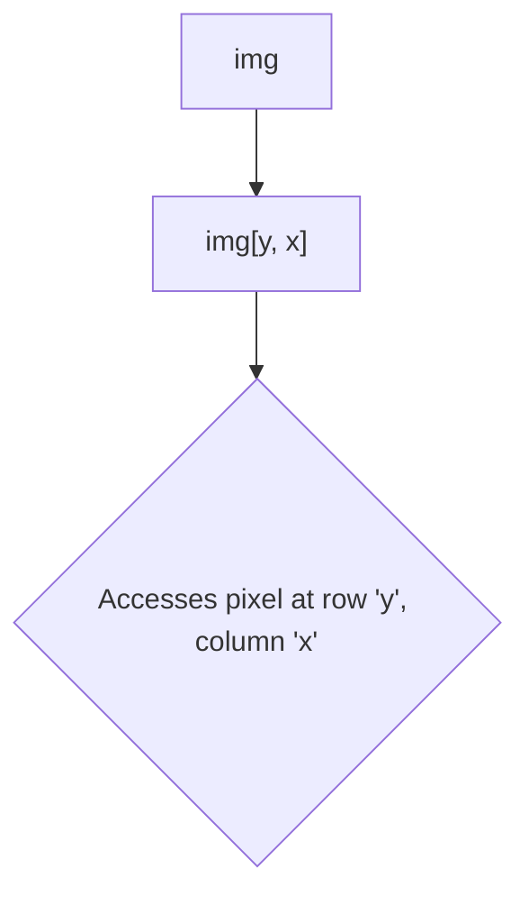

Since an image is just a NumPy array, you can access and modify individual pixel values using array indexing. This is fundamental for many low-level image processing tasks.

#Keywords
#OpenCV #PixelManipulation #NumpyArray

---

## The Coordinate System

Remember, the coordinate system is `(y, x)`, which corresponds to `(row, column)`, with `(0,0)` at the top-left.



### Accessing Pixel Values

-   **Grayscale Image:** `pixel_value = img[100, 150]`
    -   This returns a single integer (e.g., `128`).
-   **Color Image:** `bgr_value = img[100, 150]`
    -   This returns a NumPy array of 3 values, e.g., `[150, 90, 60]`, representing the Blue, Green, and Red values respectively.

### Modifying Pixel Values

You can change a pixel's value by assigning a new one.

-   **Grayscale Image:** `img[y, x] = 0` (sets the pixel to black).
-   **Color Image:** `img[y, x] = [0, 0, 255]` (sets the pixel to red in BGR).

#### Example from Lab (`Lab_tp4.py`)

The code changes the color of all pixels in the horizontal centerline to red.

```python
import cv2
import numpy as np

img = cv2.imread('Images/pepper.bmp')
height, width, _ = img.shape

# The index for the middle row
center_row = int(height / 2)

# Loop through each column index `i` from 0 to width-1
for i in range(width):
    # Access the pixel at (center_row, i) and set its value
    # OpenCV uses BGR format, so red is [0, 0, 255]
    img[center_row, i] = [0, 0, 255]

cv2.imshow('Red Line Added', img)
cv2.waitKey(0)
cv2.destroyAllWindows()
```

**Performance Note:** While iterating through pixels with `for` loops is intuitive, it is very slow in Python. For larger operations, it's much more efficient to use NumPy's built-in vectorized operations (slicing, masking) which we'll see in other sections. This example is for demonstrating the concept of direct pixel access.