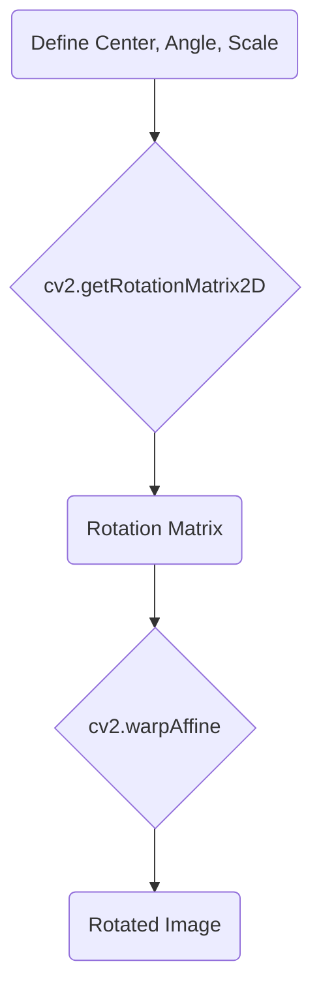

Image transformations are operations that alter the geometry or orientation of an image. The labs cover cropping, resizing, and rotating.

#Keywords
#OpenCV #Transformation #Crop #Resize #Rotate

---

## 1. Cropping (via NumPy Slicing)

Cropping is the act of selecting a rectangular sub-region of an image. The most efficient way to do this is with NumPy array slicing.

### Slicing Syntax
`cropped_array = image_array[startY:endY, startX:endX]`

-   `startY:endY`: The range of rows (Y-axis). The `endY` index is **exclusive**.
-   `startX:endX`: The range of columns (X-axis). The `endX` index is **exclusive**.

#### Example from Lab (`Lab_tp4.py`)

This code crops a `120x200` region from the image.

```python
import cv2

imgOG = cv2.imread('Images/pepper.bmp')

# Define the top-left corner (y,x) and the dimensions (h,w)
y, x = 30, 200
h, w = 120, 200

# Perform the slice to extract the region of interest
cropped_image = imgOG[y : y+h, x : x+w]

cv2.imshow('Original', imgOG)
cv2.imshow('Cropped', cropped_image)
cv2.waitKey(0)
cv2.destroyAllWindows()
```

---

## 2. Resizing

`cv2.resize()` changes the width and height of an image.

| Parameter | Type | Description |
| :--- | :--- | :--- |
| `src` | `ndarray` | The source image. |
| `dsize` | `tuple` | The desired new size as **`(width, height)`**. |
| `interpolation`| `int` | (Optional) Method used to fill in pixel values. `cv2.INTER_AREA` is good for shrinking; `cv2.INTER_CUBIC` or `cv2.INTER_LINEAR` are good for enlarging. |

#### Example from Lab (`Lab_tp4.py`)

```python
import cv2

imgOG = cv2.imread('Images/pepper.bmp')
h, w, _ = imgOG.shape

# Define new dimensions (half the original height)
new_width = w
new_height = h // 2 # Integer division

# Resize the image
resized_image = cv2.resize(imgOG, (new_width, new_height))

print(f"Original shape: {imgOG.shape}")
print(f"Resized shape: {resized_image.shape}")

cv2.imshow('Resized Image', resized_image)
cv2.waitKey(0)
cv2.destroyAllWindows()
```

---

## 3. Rotating

Rotation is a two-step process involving a **transformation matrix**.



1.  **`cv2.getRotationMatrix2D()`**: Creates the `2x3` matrix that describes the rotation.

| Parameter | Type | Description |
| :--- | :--- | :--- |
| `center` | `tuple` | The center of rotation `(x, y)`. |
| `angle` | `float` | The angle of rotation in **degrees**. Positive values mean counter-clockwise. |
| `scale` | `float` | An isotropic scale factor (1.0 means no scaling). |

2.  **`cv2.warpAffine()`**: Applies the transformation matrix to the source image.

| Parameter | Type | Description |
| :--- | :--- | :--- |
| `src` | `ndarray` | The source image. |
| `M` | `ndarray` | The `2x3` transformation matrix from the previous step. |
| `dsize` | `tuple` | The size of the output image as **`(width, height)`**. |

#### Example from Lab (`Lab_tp4.py`)

```python
import cv2

imgOG = cv2.imread('Images/pepper.bmp')
h, w, _ = imgOG.shape

# 1. Define rotation parameters
center_point = (w // 2, h // 2)
angle = 90
scale = 1.0

# 2. Get the rotation matrix
rotation_matrix = cv2.getRotationMatrix2D(center_point, angle, scale)

# 3. Apply the affine transformation
rotated_image = cv2.warpAffine(imgOG, rotation_matrix, (w, h))

cv2.imshow('Rotated Image', rotated_image)
cv2.waitKey(0)
cv2.destroyAllWindows()
```