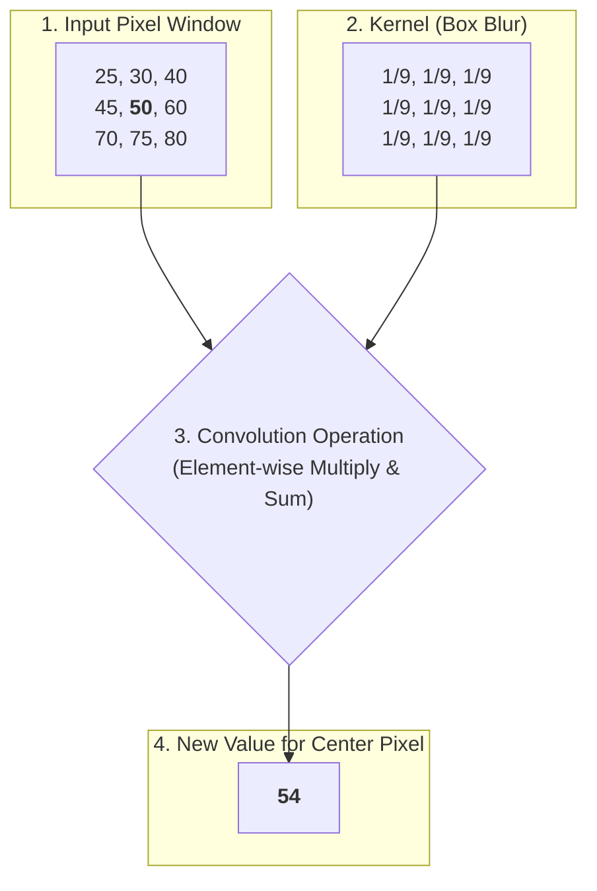

Image filtering involves using a **kernel** (a small matrix) to modify pixel values for purposes like blurring, sharpening, and noise reduction. **Exercise 2** in `Lab_solution.py` focuses on using filters to remove noise from images.

#Keywords
#OpenCV #Filtering #Blur #MedianFilter #NoiseReduction #Kernel

---

## The Kernel

A kernel is a small matrix that slides over the image. At each location, it calculates a new value for the center pixel based on its neighbors. This process is called **convolution**.


*The new value for the center pixel (50) is the weighted average of all 9 pixels in the window.*

---

## Common Noise Types

1.  **Gaussian Noise:** Random variations in brightness, looking like fine grain. Best treated with **Mean** or **Gaussian** filters.
2.  **Salt & Pepper Noise:** Random black and white pixels. Best treated with a **Median** filter.

---

## Filtering Functions

### 1. Mean Filter (`cv2.blur()`)

Replaces each pixel with the **average** of its neighbors in the kernel window. It's simple and fast for reducing Gaussian noise but blurs edges.

| Parameter | Type | Description | Example from Lab |
| :--- | :--- | :--- | :--- |
| `src` | `ndarray` | The input image. | `im2` |
| `ksize` | `tuple` | The kernel size as `(width, height)`. Must be positive and odd. | `(3, 3)` |

```python
# im2 is the image with Gaussian noise
# A larger kernel size, e.g., (7, 7), produces more blur.
imf2 = cv2.blur(im2, (3, 3))
```

### 2. Median Filter (`cv2.medianBlur()`)

Replaces each pixel with the **median** of its neighbors. It's highly effective against salt & pepper noise because the outlier black/white pixels don't affect the median value. It also preserves edges better than a mean filter.

| Parameter | Type | Description | Example from Lab |
| :--- | :--- | :--- | :--- |
| `src` | `ndarray` | The input image. | `im3` |
| `ksize` | `int` | The kernel size (e.g., `3` for a 3x3 kernel). Must be an odd number greater than 1. | `3` |

```python
# im3 is the image with Salt & Pepper noise
imf3 = cv2.medianBlur(im3, 3)
```

---

## Measuring Performance: PSNR

The lab uses **Peak Signal-to-Noise Ratio (PSNR)** to objectively measure how "good" a filtered image is compared to the clean original.

-   **Higher PSNR = Better Quality.**
-   Measured in decibels (dB).

By comparing the PSNR of the noisy image vs. the filtered image (both against the original), you can prove that the filter improved the image quality. The table generated at the end of `exercise_2` is a perfect example of this analysis.