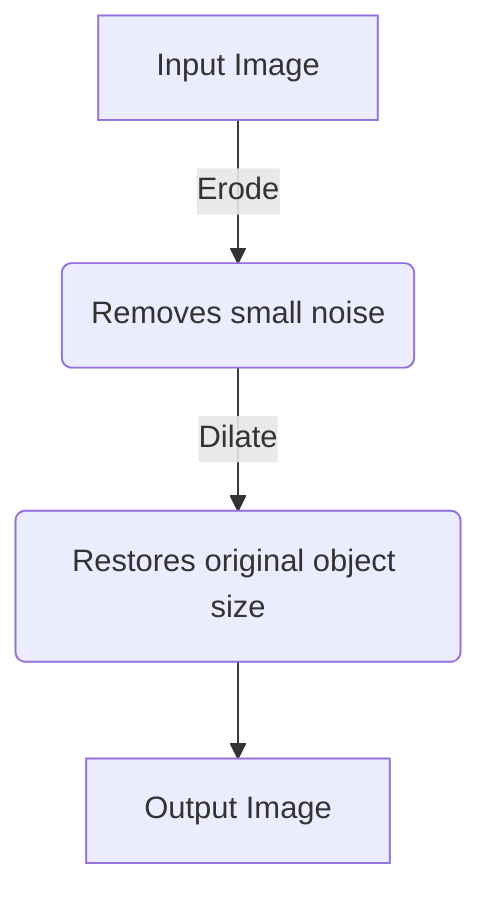
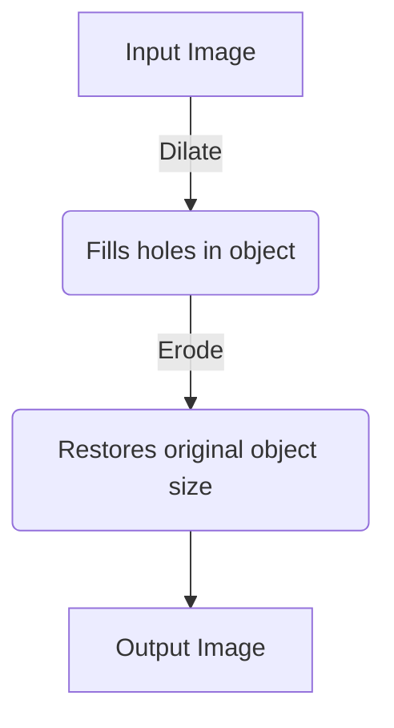

Mathematical Morphology is a set of techniques used to process images based on their shapes, typically on **binary** (black and white) images. **Exercise 4** uses these techniques to isolate and count red blood cells.

#Keywords
#OpenCV #Morphology #Erosion #Dilation #Opening #Closing #Watershed

---

## Binarization & The Structuring Element

First, an image must be made binary. The lab uses **Otsu's Binarization** (`cv2.THRESH_OTSU`) to do this automatically.

Then, a **structuring element** (or kernel) is defined. This is the shape used to probe the image.

```python
# Creates a 5x5 elliptical structuring element, good for roundish cells
kernel = cv2.getStructuringElement(cv2.MORPH_ELLIPSE, (5, 5))
```

---

## Fundamental Operations

### 1. Erosion (`cv2.erode()`)

Erodes away the boundaries of foreground objects (white areas). This makes objects smaller, removes small noise islands, and can separate connected objects.

| Parameter | Type | Description |
| :--- | :--- | :--- |
| `src` | `ndarray` | The input binary image. |
| `kernel` | `ndarray` | The structuring element. |
| `iterations`| `int` | (Optional) The number of times to apply the operation. Defaults to 1. |

```python
erosion = cv2.erode(binary_image, kernel, iterations=1)
```

### 2. Dilation (`cv2.dilate()`)

Expands the boundaries of foreground objects. This makes objects larger and can fill small holes or gaps.

| Parameter | Type | Description |
| :--- | :--- | :--- |
| `src` | `ndarray` | The input binary image. |
| `kernel` | `ndarray` | The structuring element. |
| `iterations`| `int` | (Optional) The number of times to apply the operation. Defaults to 1. |

```python
dilation = cv2.dilate(binary_image, kernel, iterations=1)
```

---

## Compound Operations

These are performed with `cv2.morphologyEx()`.

### 3. Opening (`cv2.MORPH_OPEN`)

**Erosion followed by Dilation.** It's used to remove small "salt" noise from the background without affecting the size of larger objects.


```python
opening = cv2.morphologyEx(binary_image, cv2.MORPH_OPEN, kernel)
```

### 4. Closing (`cv2.MORPH_CLOSE`)

**Dilation followed by Erosion.** It's used to fill small holes ("pepper" noise) within foreground objects.


```python
closing = cv2.morphologyEx(binary_image, cv2.MORPH_CLOSE, kernel)
```

In `exercise_4`, **Opening** is used to clean the image of artifacts before attempting to separate and count the cells.

---

## Application: Watershed for Segmentation

The lab uses the Watershed algorithm to segment (separate) the touching cells. It's a powerful technique that works as follows:

1.  **Clean Image:** Use **Opening** to remove noise.
2.  **Identify Sure Foreground:** Find areas that are definitely cells (usually the eroded cores).
3.  **Identify Sure Background:** Find areas that are definitely not cells (the area outside the dilated objects).
4.  **Identify Unknown Region:** The area between the sure foreground and background.
5.  **Apply `cv2.watershed()`:** The algorithm "floods" the image from the sure foreground markers and finds the "dams" or "watershed lines" that separate the regions. These lines are the object boundaries.
6.  **Count Objects:** The output `markers` array has a unique ID for each cell, which can then be counted.