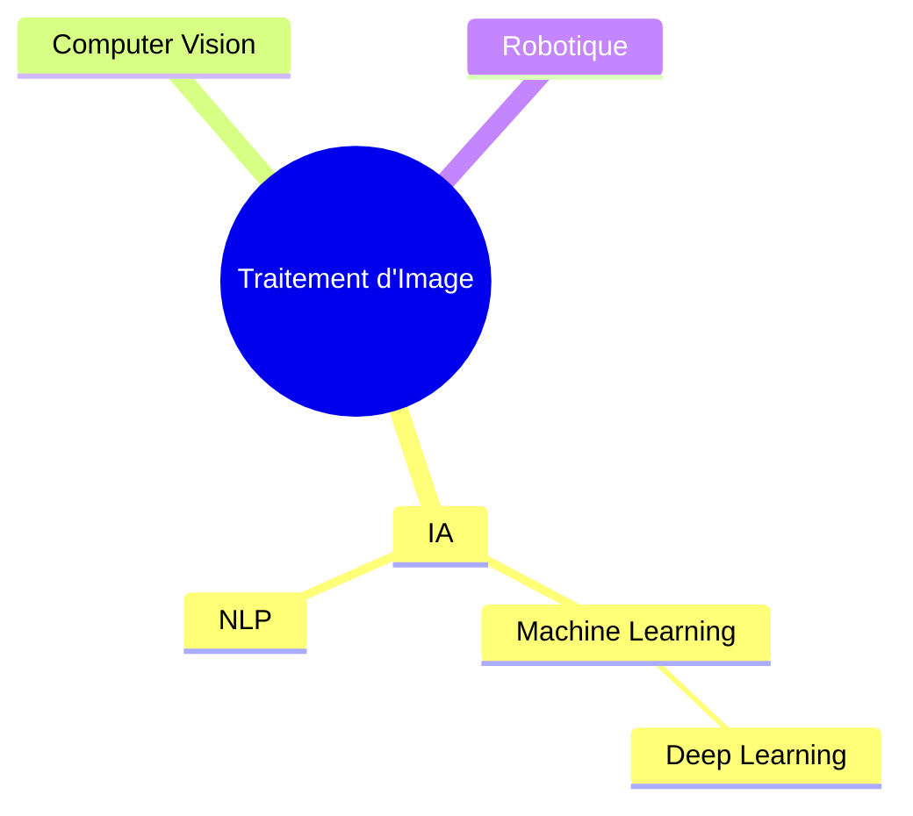
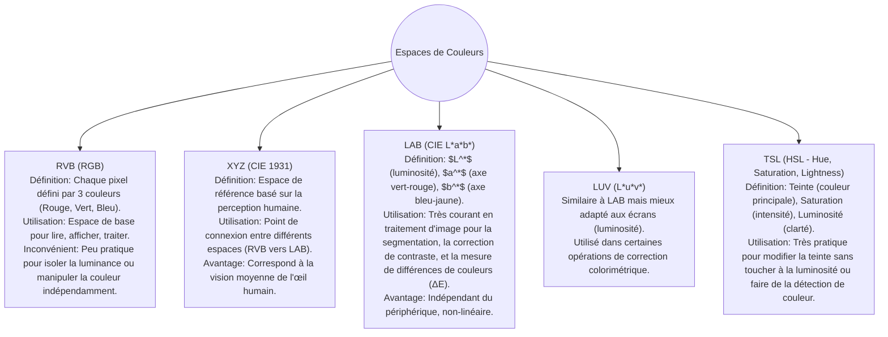
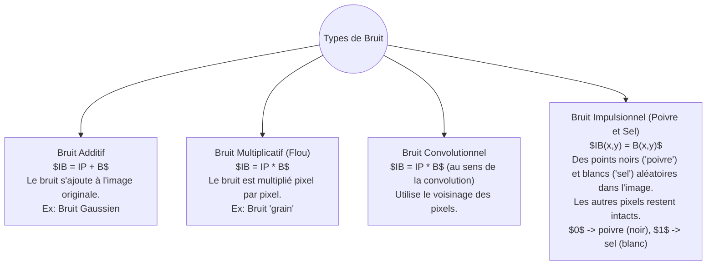

# Notes Complètes sur le Traitement d'Image

![[1.jpg]]


## Chapitre 1 : Définitions et Notions de Base

Cette section couvre les concepts fondamentaux du traitement d'image, de sa raison d'être à la définition d'une image numérique. #TraitementImage #Fondamentaux

### Pourquoi le traitement par ordinateur ?
- **Communication rapide et efficace**
- **Facilité de compréhension et de visualisation**
- **Rôle clé dans la recherche, l'imagerie médicale et l'industrie**

### Domaine du Traitement d'Image
Le traitement d'image est au carrefour de plusieurs domaines de l'intelligence artificielle et de l'informatique.


**Challenges et complexité :**
- Prise en charge de l'aspect structurel.
- L'illusion peut même tromper un œil humain.
- Le mouvement.

### Définition de l'Image Numérique
Une **image numérique** est une image stockée sous forme binaire. Elle est composée de **pixels** (petits points colorés) organisés en **matrice**.


#### Deux types d'images numériques :

| Type d'Image | Composition | Exemples de Formats | Comportement au Zoom |
| :--- | :--- | :--- | :--- |
| **Matricielle (Bitmap)** | Composée de pixels | JPEG, PNG | Si on zoome, l'image devient floue/pixelisée |
| **Vectorielle** | Composée de formes géométriques (lignes, cercles...) | SVG, AI | Si on zoome, elle reste nette à l'infini |
#ImageNumérique #Matricielle #Vectorielle

#### Caractéristiques de l'image :
- **Résolution de l'image :** Nombre de pixels par unité de longueur (par ex: pixels/pouce).
- **Couleurs des pixels :** Définies par le modèle de codage.

![[2.jpg]]


---

## Chapitre 2 : Représentation, Codage et Espaces de Couleurs

Cette section explore comment les images sont codées numériquement et les différents modèles (espaces) utilisés pour représenter la couleur. #ReprésentationImage #Codage #EspacesDeCouleurs

### Représentation et Codage d'Images

| Type | Codage | Description | Taille |
| :--- | :--- | :--- | :--- |
| **Binaire** | $1$ bit | $0$ pour noir, $1$ pour blanc | - |
| **Niveau de gris** | $8$ bits | 256 niveaux de gris (noir et blanc + nuances) | - |
| **En couleurs** | $24$ bits | ex: Modèle RVB | - |

### Espaces de Couleurs (Colorimétrique ou Chromatique)
Un espace de couleurs est un modèle mathématique décrivant la manière dont les couleurs peuvent être représentées.



#RVB #LAB #TSL #XYZ
![[3.jpg]]


---

## Chapitre 3 : Voisinage, Distance et Histogramme

Concepts essentiels pour comprendre les relations entre les pixels et la distribution des intensités. #Voisinage #Histogramme

### Voisinage d'un Pixel
Le voisinage définit les pixels adjacents à un pixel donné.

- **Voisinage à 4 ($4$-connexité) :** Pixels partageant une arête.
- **Voisinage à 8 ($8$-connexité) :** Pixels partageant une arête ou un sommet.


### Distance entre Pixels
Mesure la "proximité" entre deux pixels $P(x_p, y_p)$ et $Q(x_q, y_q)$.

| Nom de la Distance            | Formule                                                       | Description                                     |
| :---------------------------- | :------------------------------------------------------------ | :---------------------------------------------- |
| **Euclidienne**               | $d(P,Q) = \sqrt{(x_p-x_q)^2 + (y_p-y_q)^2}$                   | La distance "en ligne droite".                  |
| **de Manhattan (City Block)** | $d(P, Q) = \|x_p - x_q\| + \|y_p - y_q\|$<br>                 | Distance en suivant une grille.                 |
| **d'Echequier (Chebyshev)**   | $d(P, Q) = \max\big(\|x_p - x_q\|, \, \|y_p - y_q\|\big)$<br> | Nombre minimal de coups pour un roi aux échecs. |
#DistanceEuclidienne #DistanceManhattan

### Histogramme d'une Image
Un graphique qui montre la répartition de l'intensité des pixels. #Histogramme

- **En niveau de gris :**
    - Un seul histogramme (noir vers blanc).
    - Indique si l'image est sombre, claire ou équilibrée.
- **En couleurs :**
    - Trois histogrammes (rouge, bleu, vert).
    - Montre la quantité de chaque couleur de base dans l'image.


![[4.jpg]]

---

## Chapitre 4 : Travaux Pratiques avec OpenCV

Mise en application des concepts avec les bibliothèques Python populaires. #OpenCV #Python #Numpy #Matplotlib

### Bibliothèques Importantes
```python
import cv2
import numpy as np
import matplotlib.pyplot as plt
```

### Fonctions Principales

| Fonction | Description | Syntaxe d'Exemple |
| :--- | :--- | :--- |
| `cv2.imread()` | Lire une image depuis un chemin. | `image = cv2.imread("chemin/vers/image.jpg")` |
| `cv2.imshow()` | Afficher une image dans une fenêtre. | `cv2.imshow("Titre de la fenetre", image)` |
| `cv2.cvtColor()`| Convertir l'espace de couleur d'une image. | `gris = cv2.cvtColor(image, cv2.COLOR_BGR2GRAY)` |
| `img.shape` | Donne les dimensions de l'image (hauteur, largeur, canaux). | `h, w, c = image.shape` |

### Calcul et Affichage d'Histogramme

On peut mélanger OpenCV et Matplotlib pour une visualisation facile.

1.  **Calcul avec OpenCV :** #calcHist
    ```python
    # hist = cv2.calcHist([image], [canal], masque, [nb_bins], [plage])
    # Pour une image en niveaux de gris :
    hist = cv2.calcHist([image_gris], [0], None, [256], [0, 256])
    # Canaux : 0=Bleu, 1=Vert, 2=Rouge en BGR
    ```
2.  **Affichage avec Matplotlib :** #Matplotlib
    ```python
    plt.plot(hist, color='k') # 'k' pour noir
    plt.title("Le Titre")
    plt.show()
    ```

---

## Chapitre 5 : Dégradation d'Image et Bruit

Toute image réelle est sujette à des dégradations, principalement le bruit. #Bruit #DégradationImage

### Bruit
Le bruit correspond à des pixels modifiés aléatoirement qui perturbent l'image. Il rend l'image floue, granuleuse ou avec des points parasites.


*Légende : $IB$ = Image Bruitée, $IP$ = Image Originale, $B$ = Bruit*

### Bruit Gaussien (Additif)
C'est un bruit statistique aléatoire où les valeurs suivent une distribution normale ou gaussienne.
- **Formule :** $$IB(x,y) = IP(x,y) + n(x,y)$$
- **Distribution de $n(x,y)$ :**
  $$P(g) = \frac{1}{\sqrt{2\pi}\sigma} e^{-\frac{(g-\mu)^2}{2\sigma^2}}$$

#BruitGaussien #BruitPoivreEtSel

![[5.jpg]] 

![[6.jpg]]

![[7.jpg]]


---

## Chapitre 6 : Métriques de Qualité d'Image

Comment mesurer objectivement la qualité d'une image ou la fidélité d'une image reconstruite. #PSNR #MSE

### PSNR (Peak Signal-to-Noise Ratio)
Le **Rapport Signal sur Bruit de Crête** mesure la qualité de l'image reconstruite.
- **PSNR grand** -> bonne qualité.
- **PSNR petit** -> image dégradée.

#### Formules
1.  **MSE (Mean Squared Error - Erreur Quadratique Moyenne) :**
    C'est la différence moyenne au carré entre l'image originale et l'image bruitée/reconstruite.
    $$MSE = \frac{1}{N \times M} \sum_{x=1}^{N} \sum_{y=1}^{M} [I(x,y) - I'(x,y)]^2$$
    - $N \times M$: Nombre total de pixels.
    - $I(x,y)$: Pixel original.
    - $I'(x,y)$: Pixel bruité.

2.  **PSNR :**
    $$PSNR = 10 \log_{10}\left(\frac{MAX^2}{MSE}\right)$$
    - $MAX$: Valeur maximale possible du pixel (ex: 255 pour une image 8 bits).

### Code Python pour le PSNR

```python
# PSNR
# Code Python
def psnr(image1, image2):
    """Calcule le PSNR entre deux images."""
    if image1.shape != image2.shape:
        print("Erreur : les images n'ont pas la même taille.")
        return

    # Calcul du MSE
    # np.float64 pour éviter les dépassements de capacité
    mse = np.mean((image1.astype(np.float64) - image2.astype(np.float64)) ** 2)

    if mse == 0:
        return float('inf') # Images identiques

    R = 255  # Valeur max d'un pixel pour une image 8-bit
    psnr_value = 10 * np.log10((R**2) / mse)

    return psnr_value
```

![[5.jpg]]


---

## Chapitre 7 : Filtrage d'Image

Le filtrage modifie ou améliore une image en utilisant diverses techniques, souvent basées sur la convolution et le voisinage. #Filtrage #Convolution

### Convolution d'Image
**Définition :** C'est la modification des valeurs des pixels en cours de traitement.
- Chaque pixel peut être influencé par ses voisins.
- On utilise un **masque** (ou noyau, kernel) qui définit l'opération à appliquer sur un pixel central et ses voisins.


**Propriétés :**
- **Additivité/Distributivité :** $f * (h_1 + h_2) = f * h_1 + f * h_2$
- **Commutativité :** $f * h = h * f$
- **Associativité :** $f * (h_1 * h_2) = (f * h_1) * h_2$

### Filtres Spatiaux Linéaires (basés sur la convolution)

#### 1. Filtre Moyen
Filtre linéaire de lissage pour réduire le bruit. #FiltreMoyen
- **Principe :** Remplace chaque pixel par la **moyenne** des valeurs des pixels de son voisinage. On choisit une fenêtre (masque) de taille impaire (3x3, 5x5...).
- **Nouvelle valeur** = $$\frac{1}{\text{nb total de pixels du masque}} \sum (\text{valeurs des pixels du voisinage})$$

```python
# Code Python : Filtre Moyen
def filtre_moyen(image, taille=3):
    if taille % 2 == 0:
        taille += 1 # Assurer une taille impaire

    k = taille // 2
    h, w = image.shape
    h_sortie, w_sortie = h - taille + 1, w - taille + 1
    sortie = np.zeros_like(image, dtype=np.uint8)

    for i in range(k, h - k):
        for j in range(k, w - k):
            region = image[i-k : i+k+1, j-k : j+k+1]
            valeur_moyenne = np.mean(region)
            sortie[i, j] = np.uint8(valeur_moyenne)
    return sortie
```

#### 2. Filtre Gaussien
Remplace chaque pixel par une **moyenne pondérée** de ses voisins pour réduire le bruit et flouter l'image. #FiltreGaussien
- **Principe :**
    - La pondération diminue exponentiellement avec la distance par rapport au centre.
    - Le masque est généré à partir d'une fonction gaussienne 2D.

```python
# Code Python : Filtre Gaussien
def filtre_gaussian(image, sigma=1.2, taille=3):
    if taille % 2 == 0:
        taille += 1

    k = taille // 2
    h, w = image.shape
    sortie = np.zeros_like(image, dtype=np.uint8)

    # Création du masque gaussien
    x, y = np.meshgrid(np.arange(-k, k+1), np.arange(-k, k+1))
    masque = np.exp(-(x**2 + y**2) / (2 * sigma**2))
    masque = masque / np.sum(masque) # Normaliser

    # Application du filtre (convolution)
    for i in range(k, h-k):
        for j in range(k, w-k):
            region = image[i-k : i+k+1, j-k : j+k+1]
            valeur = np.sum(region * masque)
            sortie[i, j] = np.uint8(valeur)
    return sortie
```

### Filtres Spatiaux Non-Linéaires

#### 1. Filtre Médian
Prend la **valeur médiane** des pixels voisins. Très efficace contre le bruit impulsionnel (poivre et sel). #FiltreMédian
- **Principe :**
    1. Trier les valeurs des pixels de la région (voisinage).
    2. Prendre la valeur médiane.
    3. Remplacer le pixel central par cette valeur.

```python
# Code Python : Filtre Médian
def filtre_mediane(image, taille=3):
    if taille % 2 == 0:
        taille += 1

    k = taille // 2
    h, w = image.shape
    sortie = np.zeros_like(image, dtype=np.uint8)

    for i in range(k, h-k):
        for j in range(k, w-k):
            region = image[i-k : i+k+1, j-k : j+k+1]
            valeur_mediane = np.median(region)
            sortie[i, j] = np.uint8(valeur_mediane)
    return sortie
```

#### 2. Filtre de Nagao
Filtre de lissage pour les zones homogènes qui préserve les contours. #Nagao
- **Principe :**
    1. Définir plusieurs sous-régions autour du pixel central (ex: 9 sous-régions 3x3 pour un voisinage 5x5).
    2. Pour chaque sous-région, calculer la variance des pixels.
    3. Choisir la sous-région avec la variance minimale.
    4. Remplacer la valeur du pixel central par la **moyenne** de cette sous-région choisie.

```python
# Code Python : Filtre de Nagao
def filtre_nagao(image, taille=5):
    if taille % 2 == 0:
        taille += 1
    
    k = taille // 2
    h, w = image.shape
    sortie = np.zeros_like(image, dtype=np.uint8)
    
    # Copier les bords qui ne sont pas modifiés
    # ...

    for i in range(k, h - k):
        for j in range(k, w - k):
            # Définir les 9 sous-régions
            regions = [
                # Définir les 9 fenêtres 3x3 ici
                # Exemple pour la première (centrale)
                image[i-1:i+2, j-1:j+2],
                # ... autres 8 régions
            ]
            
            variances = []
            for r in regions:
                v = np.var(r)
                variances.append(v)
            
            # Ou bien : variances = [np.var(r) for r in regions]
            
            # Trouver l'index de la variance minimale
            best_region_idx = np.argmin(variances)
            best_region = regions[best_region_idx]
            
            # Remplacer par la moyenne de la meilleure région
            sortie[i, j] = np.uint8(np.mean(best_region))
            
    return sortie
```

### Filtrage dans le Domaine Fréquentiel
Approche alternative au filtrage spatial. #FiltrageFréquentiel
- **Fréquences :** C'est la vitesse à laquelle les valeurs des pixels changent dans l'espace.
    - **Variation lente (basse fréquence) :** Zones lisses.
    - **Variation rapide (haute fréquence) :** Détails, bruits, contours.

| Type de Filtre | Action | Résultat |
| :--- | :--- | :--- |
| **Filtre passe-bas** | Atténue les hautes fréquences | Lissage, élimination du bruit |
| **Filtre passe-haut** | Atténue les basses fréquences | Détection des contours, rehaussement des détails |
| **Filtre coupe-bande** | Atténue une bande de fréquences | Sélection de textures |

### Filtre de Gabor
Utilisé pour détecter les bords, les textures et les orientations locales. C'est un filtre linéaire dont la réponse impulsionnelle est une sinusoïde modulée par une gaussienne. #FiltreGabor


![[4.jpg]]
![[5.jpg]]
![[6.jpg]]
![[7.jpg]]
![[8.jpg]]
![[9.jpg]]